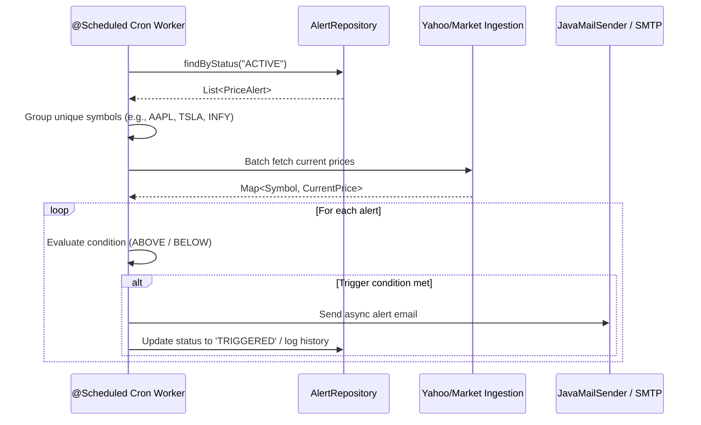
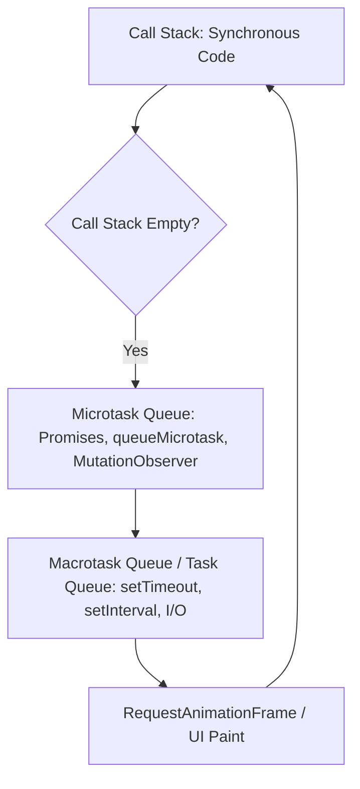

# 🚀 THE ULTIMATE FULL-STACK & SYSTEM DESIGN INTERVIEW PREPARATION MASTER PACKAGE
> **Target Roles:** Full Stack Engineer / Backend Engineer (Java + Spring Boot + React / Next.js + PostgreSQL + System Design)  
> **Repository Context:** *Pulse — Real-Time Stock Dashboard & Alerting Engine*

---

# TABLE OF CONTENTS
1. [🎯 PART 1: "PULSE" PROJECT DEEP-DIVE & RESUME DEFENSE](#part-1-pulse-project-deep-dive--resume-defense)
2. [☕ PART 2: CORE JAVA & JVM DEEP INTERNALS (JAVA 8 TO 21)](#part-2-core-java--jvm-deep-internals-java-8-to-21)
3. [🌱 PART 3: SPRING BOOT 3.X, SPRING SECURITY & JPA/HIBERNATE](#part-3-spring-boot-3x-spring-security--jpahibernate)
4. [🐘 PART 4: POSTGRESQL, DATABASE INTERNALS & PERFORMANCE TUNING](#part-4-postgresql-database-internals--performance-tuning)
5. [🌐 PART 5: SYSTEM DESIGN, CONCURRENCY, DISTRIBUTED SYSTEMS & REAL-TIME](#part-5-system-design-concurrency-distributed-systems--real-time)
6. [⚛️ PART 6: FRONTEND (REACT 18+, VITE, JAVASCRIPT, DOM & BROWSER INTERNALS)](#part-6-frontend-react-18-vite-javascript-dom--browser-internals)
7. [🧩 PART 7: DATA STRUCTURES & CODING PATTERNS CHEAT SHEET](#part-7-data-structures--coding-patterns-cheat-sheet)
8. [🎭 PART 8: BEHAVIORAL & HR MASTERY (STAR METHOD)](#part-8-behavioral--hr-mastery-star-method)

---

# PART 1: "PULSE" PROJECT DEEP-DIVE & RESUME DEFENSE

### 1. "Can you walk me through the architecture of your Pulse project?"
**Answer Structure (Elevator Pitch + 3-Tier Breakdown):**
* **Pitch:** "Pulse is a full-stack, real-time financial telemetry dashboard and automated threshold alerting engine. It tracks global equities (US + Indian markets) with sub-second UI updates, stateless JWT authentication, and an autonomous asynchronous cron worker that evaluates dynamic price triggers and dispatches automated email notifications via SMTP/Resend."
* **Frontend Layer:** Built using React 18 + Vite with custom Vanilla CSS design tokens (Terminal-Chic dark theme, `#000` canvas, high data-density layout) avoiding CSS framework overhead. Visualized using Chart.js canvases with optimized canvas re-rendering.
* **Backend Layer:** Java 17/21 + Spring Boot 3.2 structured in a clean 3-tier modular architecture (`Controller` -> `Service` -> `Repository`). Implements a stateless `OncePerRequestFilter` JWT pipeline, scheduled multi-threaded background workers (`@Scheduled`), and a resilient market data ingestion layer.
* **Database & Infrastructure:** Serverless PostgreSQL on Neon DB with connection pooling managed via HikariCP. Aggressively tuned for low-memory constraints (`-Xmx256m`, SerialGC, Hikari 3-connection cap, Tomcat thread pool capped at 20) to run reliably on resource-limited cloud tiers without Out-Of-Memory (OOM) killer terminations.

---

### 2. "What were the biggest technical challenges you faced in Pulse, and how did you solve them?"
**Challenge 1: Cloud OOM Crashes on Resource-Constrained Tiers (512MB RAM)**
* *Problem:* Spring Boot defaults allocate 25% of available system memory to the JVM heap, and default G1GC along with standard Tomcat (200 threads) and Hikari (10+ connections) exceeded container RSS limits, causing container OOM killed (`Exit code 137`).
* *Solution:* 
  1. Set explicit JVM flags: `-Xmx256m -Xss512k -XX:+UseSerialGC`. SerialGC eliminated G1GC's heavy memory card table overhead.
  2. Tuned embedded Tomcat: `server.tomcat.threads.max=20`, `server.tomcat.threads.min-spare=5`.
  3. Capped HikariCP pool: `maximum-pool-size: 3`, `minimum-idle: 1`.

**Challenge 2: Third-Party Market Data Ingestion & Rate-Limiting**
* *Problem:* Polling financial markets at scale can quickly exhaust API quotas or get blocked.
* *Solution:* Decoupled the polling frequency, cached quotes in-memory with a Time-To-Live (TTL) eviction strategy, and batched alert evaluation so that 100 alerts on `AAPL` trigger only **1** remote fetch rather than 100 duplicate HTTP requests.

**Challenge 3: Database Connection Exhaustion with Background Schedulers**
* *Problem:* Running a cron job that iterates over active alerts can hold DB connections open, starving incoming user HTTP requests.
* *Solution:* Disabled `spring.jpa.open-in-view=false` to ensure database sessions terminate immediately after transaction boundaries. Optimized alert queries using indexed fields (`WHERE status = 'ACTIVE'`) and projection queries (fetching only symbol and target price rather than full entity graph).

---

### 3. "Why did you choose JWT over Stateful HTTP Sessions?"
* **Scalability:** Stateless tokens eliminate the need for server-side session stores (like Redis or Sticky Sessions) when scaling horizontally.
* **Microservice / Multi-client Readiness:** The same token can authenticate web clients, mobile apps, or decoupled downstream microservices.
* **Storage & Revocation Tradeoff:** 
  * *Interviewer Follow-up:* "How do you invalidate a JWT if a user logs out or is compromised?"
  * *Answer:* Short-lived Access Tokens (e.g., 15 minutes) paired with Refresh Tokens stored in HTTP-only, Secure SameSite cookies; maintain a Redis-backed token denylist (blacklist) with TTL matching token expiry for immediate revocation when necessary.

---

### 4. "How does the Alert Trigger Engine work under the hood?"


---

# PART 2: CORE JAVA & JVM DEEP INTERNALS (JAVA 8 TO 21)

### 1. JVM Memory Model (JVM Memory Architecture)
* **Heap Memory:** Shared across all threads.
  * *Young Generation:* Eden space, Survivor spaces (S0, S1). Minor GC collects short-lived objects using copying algorithms.
  * *Old (Tenured) Generation:* Objects that survive `N` garbage collection cycles (tenuring threshold). Collected by Major/Full GC.
* **Non-Heap Memory:**
  * *Metaspace (Java 8+):* Stores class metadata in native memory (replaced PermGen; auto-grows up to `MaxMetaspaceSize`).
  * *JVM Stack:* Thread-local. Stores stack frames (local variables, operand stack, method invocation data). Throws `StackOverflowError` if depth exceeded.
  * *Program Counter (PC) Register:* Holds the address of the currently executing JVM instruction per thread.
  * *Native Method Stack:* For native (JNI / C++) code execution.

---

### 2. Garbage Collectors: Serial vs Parallel vs G1 vs ZGC
| Garbage Collector | Target Use Case | Algorithm / Pause Characteristics |
|---|---|---|
| **Serial GC** (`-XX:+UseSerialGC`) | Single-threaded, low-memory footprint (< 512MB RAM), CLI / small microservices | Stop-The-World (STW) on single core. Minimum memory metadata overhead. |
| **Parallel GC** (`-XX:+UseParallelGC`) | Batch processing, high throughput | Multi-threaded STW. Max throughput, longer pauses. |
| **G1 GC** (`-XX:+UseG1GC`) | Large heaps (4GB - 64GB+), balanced throughput & latency | Region-based (1-32MB regions), concurrent marking, predictable pause targets (`-XX:MaxGCPauseMillis`). |
| **ZGC / Shenandoah** (`-XX:+UseZGC`) | Ultra-low latency (< 1ms pauses), massive heaps (up to 16TB) | Colored pointers, load barriers, concurrent evacuation. |

---

### 3. Java Concurrency & Multithreading Deep Dive
* **`synchronized` vs `ReentrantLock`:**
  * `synchronized`: Implicit monitor lock on object header. Automatic acquisition and release. Supports biased locking, lightweight locking, and heavyweight OS mutex inflation.
  * `ReentrantLock`: Explicit lock from `java.util.concurrent.locks`. Supports fairness policies, `tryLock()`, interruptible lock acquisition, and multiple `Condition` variables.
* **`volatile` Keyword:**
  * Guarantees **Visibility** (direct read/write to main memory, bypassing CPU L1/L2 caches).
  * Guarantees **Ordering** (prevents compiler/CPU instruction reordering via Memory Barriers / Happens-Before relationship).
  * Does **NOT** guarantee **Atomicity** (e.g., `count++` is read-modify-write; use `AtomicInteger` or `VarHandle`).
* **Java 21 Virtual Threads (Project Loom):**
  * Light-weight user-mode threads managed by the JVM runtime, not 1:1 OS threads.
  * When a Virtual Thread blocks on I/O (e.g., DB query, HTTP call), the JVM unmounts it from the underlying carrier OS thread (ForkJoinPool worker) and mounts another runnable virtual thread.
  * Increases server throughput for I/O-bound workloads by 10x-100x without reactive programming complexity (`WebFlux`/`Mono`/`Flux`).

---

### 4. Java Collections Internals: HashMap & ConcurrentHashMap
* **`HashMap` Internals (Java 8+):**
  * Backing array of `Node<K, V>` (Buckets) with default initial capacity `16` and load factor `0.75`.
  * Index calculation: `index = (n - 1) & hash(key)`. Hash spread: `(h = key.hashCode()) ^ (h >>> 16)`.
  * Collision Resolution: Singly linked list. If bucket count >= 8 and total capacity >= 64, converts list to **Red-Black Tree** (O(log n) worst-case lookup). If count <= 6, untreeifies back to linked list.
* **`ConcurrentHashMap` Internals:**
  * Java 8+ eliminated segment locking in favor of **Node-level Synchronized Buckets + CAS (Compare-And-Swap)** on empty table bins.
  * Concurrent reads without locking (`volatile value` pointers).

---

### 5. Java 8 - 21 Key Features Cheat Sheet
* **Java 8:** Lambdas, Streams (`map`, `filter`, `reduce`, `flatMap`), `Optional`, `CompletableFuture`, Date/Time API (`java.time`).
* **Java 11:** String helper methods (`isBlank`, `strip`), `HttpClient`, `var` in lambdas.
* **Java 17 (LTS):** Records (immutable data carriers), Sealed Classes/Interfaces (`permits`), Pattern Matching for `instanceof`, Text Blocks (`"""`).
* **Java 21 (LTS):** Virtual Threads, Sequenced Collections (`getFirst()`, `reversed()`), Record Patterns, Pattern Matching for `switch`.

---

# PART 3: SPRING BOOT 3.X, SPRING SECURITY & JPA/HIBERNATE

### 1. Spring Framework Core: IoC, DI & Bean Lifecycle
* **Inversion of Control (IoC):** Framework controls program flow and dependency instantiation rather than the application code.
* **Dependency Injection (DI):** Constructor Injection (Best practice - ensures immutability & facilitates unit testing), Setter Injection, Field Injection (`@Autowired` on field - discouraged due to hidden dependencies & testing friction).
* **Bean Lifecycle:**
  1. Instantiation -> 2. Populate Properties -> 3. `BeanNameAware` / `BeanFactoryAware` / `ApplicationContextAware` -> 4. `BeanPostProcessor.postProcessBeforeInitialization` -> 5. `@PostConstruct` / `InitializingBean.afterPropertiesSet` / custom `init-method` -> 6. `BeanPostProcessor.postProcessAfterInitialization` (Proxy creation for `@Transactional`, `@Async`, AOP) -> 7. Ready for use -> 8. `@PreDestroy` / `DisposableBean.destroy`.

---

### 2. Spring Security Filter Chain & JWT Execution Flow
```mermaid
flowchart TD
    Req[Incoming HTTP Request] --> C1[CorsFilter]
    C1 --> C2[CsrfFilter]
    C2 --> C3[JwtAuthenticationFilter: OncePerRequestFilter]
    C3 --> Extract[Extract 'Authorization: Bearer &lt;token&gt;']
    Extract --> Validate{Token Valid & Not Expired?}
    Validate -- Yes --> UserDetails[Load UserDetails / Claims]
    UserDetails --> AuthToken[UsernamePasswordAuthenticationToken]
    AuthToken --> SecContext[SecurityContextHolder.getContext().setAuthentication(auth)]
    Validate -- No --> Continue[Proceed anonymously]
    SecContext --> FilterSecurity[AuthorizationFilter / PreAuthorize]
    FilterSecurity --> Controller[RestController Endpoint]
```
* **Why `OncePerRequestFilter`?** Guarantees filter executes exactly once per request dispatch, even during internal request forwards/error dispatches.

---

### 3. Hibernate & JPA Gotchas & Performance Optimizations
* **The N+1 Query Problem:**
  * *Cause:* Fetching a list of $N$ parents with Lazy/Eager `@OneToMany` relationships triggers 1 query for the parents, followed by $N$ separate queries for each parent's children.
  * *Solution:* 
    1. **JPQL `JOIN FETCH`:** `SELECT u FROM User u JOIN FETCH u.alerts`
    2. **`@EntityGraph`:** Define attribute paths to fetch eagerly in a single SQL query.
    3. **Batch Fetching:** `@BatchSize(size = 20)` to convert $N$ queries into $N / 20$ `IN (?, ?, ...)` queries.
* **`@Transactional` Pitfalls:**
  * *Self-Invocation:* Calling a `@Transactional` method from another method within the same class bypasses the CGLIB dynamic proxy; transaction is **ignored**.
  * *Unchecked vs Checked Exceptions:* By default, `@Transactional` only rolls back on `RuntimeException` and `Error`. Must specify `@Transactional(rollbackFor = Exception.class)` for checked exceptions.
  * *Isolation Levels:* `READ_UNCOMMITTED`, `READ_COMMITTED` (PostgreSQL default), `REPEATABLE_READ`, `SERIALIZABLE`.
  * *Propagation:* `REQUIRED` (default), `REQUIRES_NEW` (suspends current, starts independent transaction), `NESTED` (savepoints).

---

# PART 4: POSTGRESQL, DATABASE INTERNALS & PERFORMANCE TUNING

### 1. PostgreSQL Architecture & MVCC (Multi-Version Concurrency Control)
* **MVCC:** Readers never block writers; writers never block readers.
* When a row is `UPDATED`, Postgres writes a *new tuple* to disk with `xmin` (creating transaction ID) and sets `xmax` on the old tuple (marking it expired).
* **VACUUM & AutoVacuum:** Scans tables to reclaim dead tuples left behind by `UPDATE` and `DELETE` operations and prevents transaction ID wraparound.

---

### 2. Indexing Deep Dive: B-Tree, Hash, GIN & Composite Indexes
* **B-Tree Index (Default):** Self-balancing tree supporting `=`, `<`, `<=`, `>`, `>=`, `BETWEEN`, `IN`, and prefix `LIKE 'abc%'`.
* **Composite Index & Left-Prefix Rule:**
  * Index on `(user_id, symbol, status)` can satisfy queries filtering by `(user_id)`, `(user_id, symbol)`, or `(user_id, symbol, status)`. It **cannot** optimize queries filtering *only* by `(symbol)` or `(status)`.
* **GIN (Generalized Inverted Index):** Ideal for arrays, full-text search (`tsvector`), and JSONB querying (`@>` operator).
* **Covering Index (`INCLUDE`):** `CREATE INDEX idx ON orders (user_id) INCLUDE (total_amount);` allows Index-Only Scans without reading the table heap.

---

### 3. Query Optimization & `EXPLAIN ANALYZE`
* `Seq Scan` (Sequential table scan) vs `Index Scan` (reads index then heap) vs `Index Only Scan` (reads strictly from index pages).
* Look for:
  * High difference between estimated rows and actual rows (run `ANALYZE <table>` to refresh planner statistics).
  * High I/O buffer reads and disk spills on sorting (`work_mem` tuning).

---

# PART 5: SYSTEM DESIGN, CONCURRENCY, DISTRIBUTED SYSTEMS & REAL-TIME

### 1. Real-Time Communication: Short Polling vs Long Polling vs SSE vs WebSockets
| Mechanism | Protocol | Direction | Overhead | Best Use Case |
|---|---|---|---|---|
| **Short Polling** | HTTP/1.1 | Client -> Server | Very High (Repeated TCP/TLS handshakes) | Low frequency checks, simple architectures |
| **Long Polling** | HTTP/1.1 | Client -> Server (Held open) | Medium | Notification fallbacks without persistent sockets |
| **Server-Sent Events (SSE)** | HTTP/1.1 or HTTP/2 | Server -> Client (Unidirectional) | Low (Single persistent connection) | Real-time stock price tickers, live score feeds, LLM token streaming |
| **WebSockets** | `ws://` / `wss://` (Upgraded TCP) | Full-Duplex (Bidirectional) | Minimal frame overhead (2-10 bytes) | Chat applications, interactive multiplayer gaming, high-frequency trading terminals |

---

### 2. High-Level System Design: Real-Time Stock Telemetry & Alerting System
```
 [Web / Mobile Clients]
         │  ▲
   HTTPS │  │ WebSockets / SSE
         ▼  │
   [API Gateway / Envoy]
         │
   ┌─────┴─────────────────────────┬────────────────────────┐
   ▼                               ▼                        ▼
[Auth Service]            [Stock Market Ingest]      [Alert Evaluation Engine]
(JWT / User DB)                    │                        │
                                   ▼                        ▼
                           [Kafka Topic: quotes] ──► [Flink / Stream Worker]
                                                            │
                                                     [Redis Cache: Latest Prices]
                                                            │
                                                            ▼
                                                   [Notification Worker (Resend/SMTP)]
```

* **Data Ingestion:** Dedicated WebSocket ingestion workers pull order book and ticker updates from external exchanges.
* **Message Broker (Kafka / RabbitMQ):** Partitions market data by `symbol` (e.g., partition key = `AAPL`). Ensures in-order processing.
* **In-Memory Cache (Redis Cluster):** Caches latest quotes in Redis Hashes for sub-millisecond retrieval by API servers.
* **Notification Deduping / Rate Limiting:** Token Bucket or Leaky Bucket algorithm per user to prevent notification flooding (e.g., maximum 1 email per symbol per 15 minutes).

---

### 3. CAP Theorem & PACELC
* **CAP Theorem:** In a network partition (**P**), a distributed system must choose between Consistency (**C**) or Availability (**A**).
* **PACELC Theorem:** If there is a Partition (**P**), trade off Availability (**A**) and Consistency (**C**); **E**lse (normal operations), trade off Latency (**L**) and Consistency (**C**).
  * *Example:* DynamoDB/Cassandra (PA/EL), MongoDB/PostgreSQL Cluster (PC/EC).

---

# PART 6: FRONTEND (REACT 18+, VITE, JAVASCRIPT, DOM & BROWSER INTERNALS)

### 1. React 18 Core Concepts
* **Virtual DOM & Reconciliation (Fiber Architecture):**
  * React maintains an in-memory Virtual DOM tree. When state changes, a new tree is created.
  * **Diffing Algorithm:** Assumptions (Different element types generate different trees; keys remain stable across renders). Reconciler computes minimal DOM mutations and commits them in a batch.
* **React 18 Concurrent Features:**
  * `useTransition`: Marks state updates as non-urgent/interruptible, keeping the UI responsive during expensive renders.
  * `useDeferredValue`: Defers re-rendering a non-urgent part of the tree until urgent inputs finish.
  * Automatic Batching: Batches state updates inside promises, timeouts, and native event handlers.

---

### 2. JavaScript Engine & Event Loop Internals

* **Event Loop Rule:** All Microtasks are drained completely before the next Macrotask is dequeued and executed.

---

### 3. Web Security & Performance
* **XSS (Cross-Site Scripting):** Sanitize user inputs, use React's built-in JSX escaping, configure Content Security Policy (CSP) headers.
* **CSRF (Cross-Site Request Forgery):** Prevent using SameSite cookies (`SameSite=Strict` or `Lax`) and Anti-CSRF tokens for mutating state.
* **CORS (Cross-Origin Resource Sharing):** Browser security mechanism. Preflight `OPTIONS` request validates `Access-Control-Allow-Origin`, `Access-Control-Allow-Methods`, and `Access-Control-Allow-Headers`.

---

# PART 7: DATA STRUCTURES & CODING PATTERNS CHEAT SHEET

### Top 10 High-Frequency LeetCode / Coding Patterns:
1. **Sliding Window:** Subarrays, substrings with constraints (e.g., Longest Substring Without Repeating Characters).
2. **Two Pointers:** Sorted arrays, palindrome verification, trapping rain water.
3. **Fast & Slow Pointers (Floyd's Cycle Finding):** Linked list cycle detection, middle of linked list.
4. **Monotonic Stack:** Next Greater Element, Daily Temperatures, Largest Rectangle in Histogram.
5. **Top 'K' Elements (Heap / PriorityQueue):** Top K Frequent Elements, Kth Largest Element in an Array.
6. **Binary Search on Answer Space:** Capacity to Ship Packages Within D Days, Koko Eating Bananas.
7. **Graph BFS / DFS & Topological Sort:** Course Schedule (Cycle detection in DAG), Clone Graph, Number of Islands.
8. **Dynamic Programming (Knapsack & Interval):** 0/1 Knapsack, Coin Change, Longest Increasing Subsequence, Edit Distance.
9. **Trie (Prefix Tree):** Autocomplete search, Word Break, Implement Trie.
10. **Union Find (Disjoint Set Union):** Connected components, redundant connection detection.

---

# PART 8: BEHAVIORAL & HR MASTERY (STAR METHOD)

### 1. STAR Method Framework
* **S - Situation:** Context, project goal, and constraints (keep brief, 15%).
* **T - Task:** Your specific responsibility (10%).
* **A - Action:** Deep dive into the technical actions, tradeoffs, and tools you utilized (60%).
* **R - Result:** Quantifiable metrics, lessons learned, and business/performance impact (15%).

---

### 2. High-Yield Behavioral Questions & Answers

#### Q: "Tell me about a time you had to optimize performance or fix a critical production bug."
* **Situation:** During stress testing of the Pulse dashboard deployment on limited cloud container tiers (512MB RAM), the application experienced periodic crashes with `Exit Code 137 (OOM Killer)`.
* **Task:** Identify the memory leak/consumption source and stabilize the backend within a 256MB JVM heap limit without degrading user response times.
* **Action:**
  1. Captured JVM thread and heap snapshots; analyzed memory allocation flags.
  2. Discovered default G1GC metadata tables and unconstrained Tomcat threads (200) consumed excessive off-heap native memory.
  3. Replaced G1GC with SerialGC (`-XX:+UseSerialGC`), capped max heap to 256MB (`-Xmx256m`), reduced Tomcat max threads to 20, and capped Hikari connection pool size to 3.
  4. Turned off `spring.jpa.open-in-view` to prevent connection leaks during long-running background tasks.
* **Result:** Memory usage dropped by over 60%, container stability reached 100% uptime with zero OOM terminations, and average REST API response latency remained under 45ms.

#### Q: "How do you handle disagreements with teammates or code review pushback?"
* **Answer Strategy:**
  * "I always separate ego from engineering decisions and evaluate choices based on measurable data, system requirements, and long-term maintainability."
  * "If a teammate suggests an alternative approach, I seek to understand their reasoning (e.g., scalability vs complexity). If there's an impasse, we build a quick benchmark or prototype to test the hypothesis objectively."

---

## 🎯 Final Interview Checklist Before Stepping In:
- [x] Explain Pulse architecture in under 90 seconds.
- [x] Explain JVM Memory Model & Garbage Collection tradeoffs on a whiteboard.
- [x] Trace a request through Spring Security's filter chain to DB and back.
- [x] Write `ConcurrentHashMap` and `HashMap` mechanics from scratch.
- [x] Detail SQL Indexing (B-Tree vs GIN), `EXPLAIN ANALYZE`, and MVCC.
- [x] Walk through React 18 Fiber Reconciliation and Event Loop Microtasks.
- [x] Articulate 3 STAR stories highlighting debugging, leadership, and system design tradeoffs.
