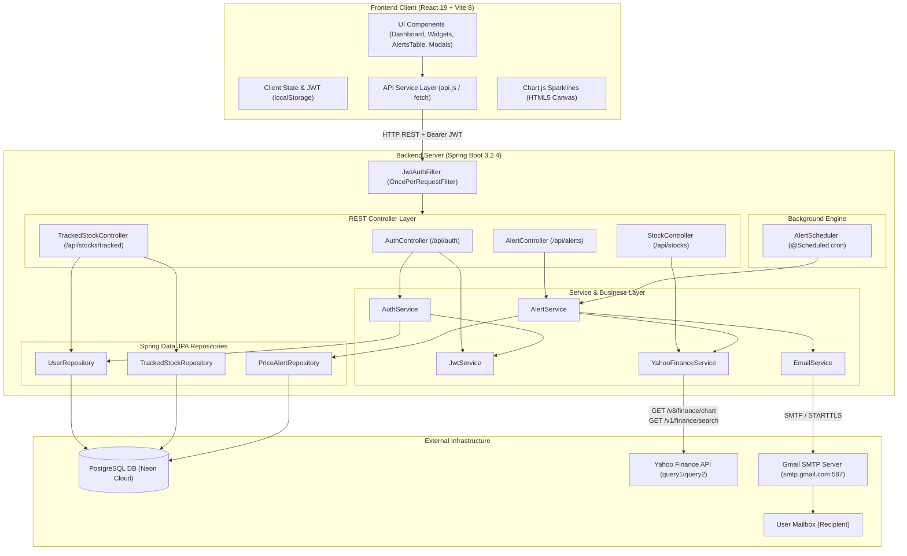
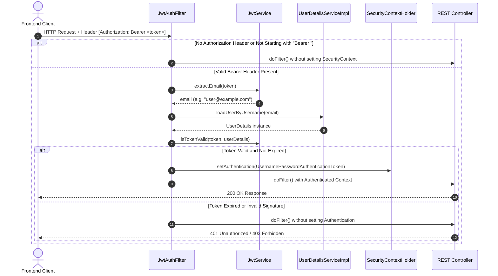
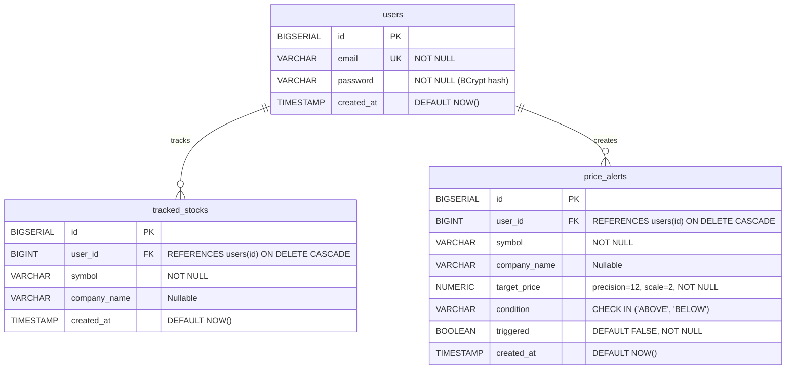
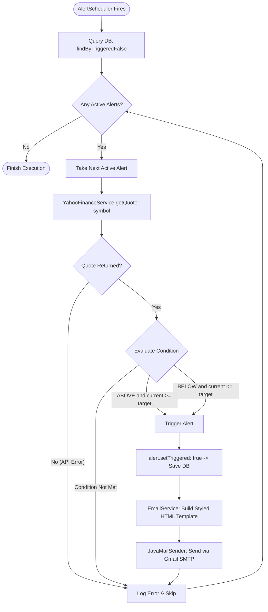
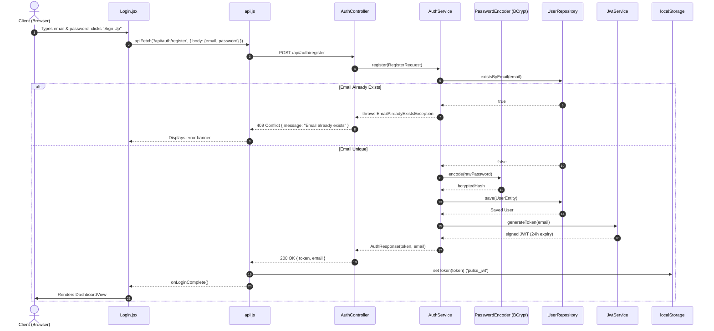
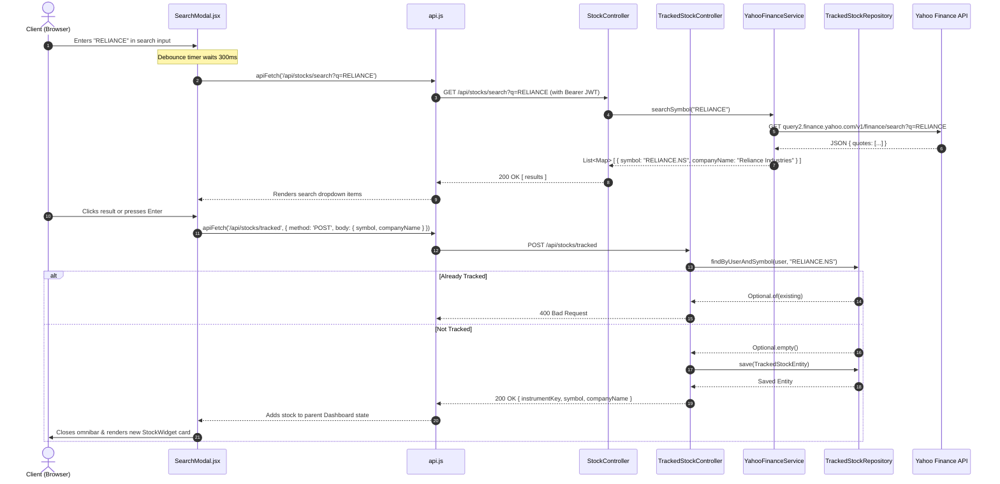
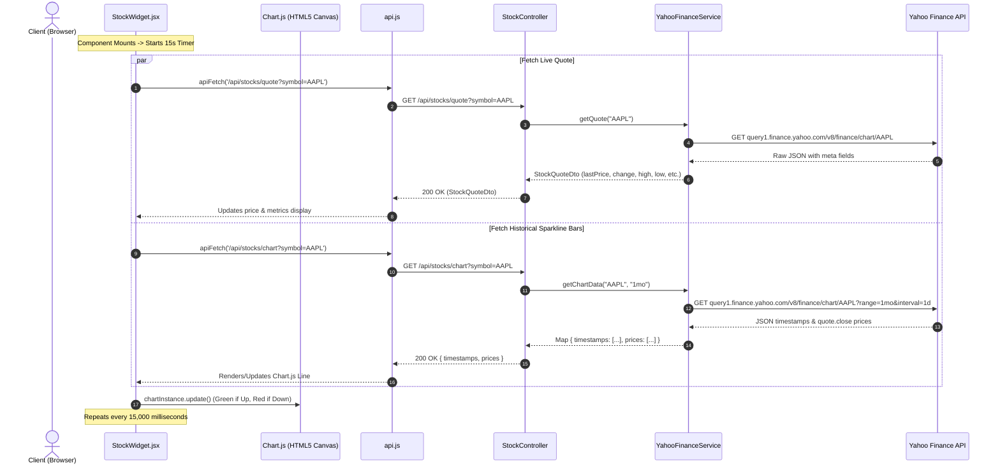
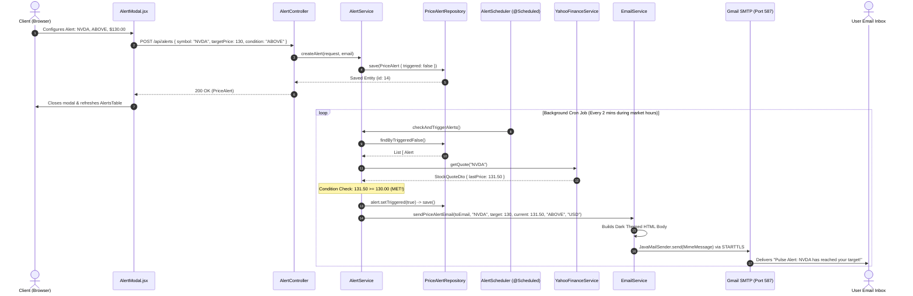

# PULSE: Complete Architecture, System Design & End-to-End Data Flow Specification

> **Document Type:** Technical Architecture & System Specification  
> **Target Systems:** `backend` (Spring Boot 3.2.4 / Java 17) & `frontend` (React 19 / Vite 8)  
> **Source Code Verification:** 100% ground-up verified against active source code.

---

## Table of Contents
1. [Executive Overview & Tech Stack Matrix](#1-executive-overview--tech-stack-matrix)
2. [High-Level Architecture Diagrams](#2-high-level-architecture-diagrams)
3. [Deep Dive: Backend Architecture & Implementation Details](#3-deep-dive-backend-architecture--implementation-details)
   - [3.1 Directory & Package Structure](#31-directory--package-structure)
   - [3.2 Application Bootstrap & Global Configuration](#32-application-bootstrap--global-configuration)
   - [3.3 Security, Authentication & JWT Lifecycle](#33-security-authentication--jwt-lifecycle)
   - [3.4 Entity Model & Database Schema (Flyway Migrations)](#34-entity-model--database-schema-flyway-migrations)
   - [3.5 Data Access Layer (Repositories)](#35-data-access-layer-repositories)
   - [3.6 Service Layer & Business Logic](#36-service-layer--business-logic)
   - [3.7 Background Engine & Scheduled Jobs](#37-background-engine--scheduled-jobs)
   - [3.8 Global Exception Handling & Error Protocol](#38-global-exception-handling--error-protocol)
   - [3.9 Performance, JVM Optimization & Docker Deployment](#39-performance-jvm-optimization--docker-deployment)
4. [Deep Dive: Frontend Architecture & Implementation Details](#4-deep-dive-frontend-architecture--implementation-details)
   - [4.1 Directory & Component Structure](#41-directory--component-structure)
   - [4.2 Authentication State & Routing Engine](#42-authentication-state--routing-engine)
   - [4.3 API Client Layer & Auth Interceptors](#43-api-client-layer--auth-interceptors)
   - [4.4 Component Anatomy & Interactive Logic](#44-component-anatomy--interactive-logic)
   - [4.5 Design System & CSS Token Architecture](#45-design-system--css-token-architecture)
5. [Comprehensive API Contract & Data Exchange Catalog](#5-comprehensive-api-contract--data-exchange-catalog)
   - [5.1 Authentication APIs](#51-authentication-apis)
   - [5.2 Stock Market Data APIs](#52-stock-market-data-apis)
   - [5.3 Tracked Stocks (Watchlist) APIs](#53-tracked-stocks-watchlist-apis)
   - [5.4 Price Alert APIs](#54-price-alert-apis)
6. [End-to-End Sequence Workflows](#6-end-to-end-sequence-workflows)
   - [6.1 User Registration & Login Flow](#61-user-registration--login-flow)
   - [6.2 Stock Search & Watchlist Ingestion Flow](#62-stock-search--watchlist-ingestion-flow)
   - [6.3 Real-Time Stock Quote & Chart Sparkline Polling](#63-real-time-stock-quote--chart-sparkline-polling)
   - [6.4 Alert Setup, Cron Evaluation & Email Notification Flow](#64-alert-setup-cron-evaluation--email-notification-flow)
   - [6.5 Stock & Alert Deletion Flows](#65-stock--alert-deletion-flows)

---

## 1. Executive Overview & Tech Stack Matrix

**Pulse** is a lightweight, high-performance financial tracking and price monitoring application. It enables authenticated users to search equities/ETFs, maintain a real-time watchlist with live sparkline charts, and configure custom price breach alerts (`ABOVE` / `BELOW`) that trigger automated background price checks and direct HTML email notifications.

### 1.1 Technology Stack

| Layer | Technology | Version | Purpose |
| :--- | :--- | :--- | :--- |
| **Backend Framework** | Spring Boot | `3.2.4` | Core application framework, dependency injection, REST controllers |
| **Language & Runtime** | Java / JDK | `17` (Eclipse Temurin) | Modern LTS Java runtime environment |
| **Security & Auth** | Spring Security + JJWT | `0.12.6` (jjwt-api, impl, jackson) | Stateless Bearer token authentication with HMAC-SHA256 signing |
| **Password Hashing** | BCrypt | Part of Spring Security | Secure salt-hashed password storage |
| **Database Engine** | PostgreSQL (Neon Serverless) | Compatible with PG 15+ | Relational persistence with SSL connection (`sslmode=require`) |
| **Schema Migration** | Flyway DB | `flyway-core` | Automated versioned SQL migrations (`V1`, `V2`, `V3`) |
| **Data Access** | Spring Data JPA / Hibernate | Spring Boot default | ORM, custom repositories, declarative transactions (`@Transactional`) |
| **External Market Data** | Yahoo Finance Chart & Search API | HTTP REST (v8/v1) | Live regular market quotes, historical OHLCV chart bars, symbol search |
| **Scheduled Worker** | Spring Scheduling (`@Scheduled`) | Spring Boot default | Cron-based background evaluation (`alert.scheduler.cron`) |
| **Email Delivery** | Spring Starter Mail (Jakarta Mail) | Spring Boot default | SMTP client targeting `smtp.gmail.com:587` with STARTTLS |
| **Frontend Framework** | React | `19.2.7` | UI component library with Hooks (`useState`, `useEffect`, `useRef`) |
| **Bundler & Dev Server** | Vite | `8.1.1` | Fast ES module bundler and development server |
| **Charting Engine** | Chart.js | `4.5.1` (chart.js/auto) | HTML5 Canvas-based sparkline charts |
| **Styling & Theme** | Vanilla CSS (CSS Variables) | Custom Design System | Dark terminal aesthetic, tabular numeric typography, micro-animations |
| **Containerization** | Multi-Stage Dockerfile | Maven 3.9.6 + Temurin 17 JRE | Optimized production container with tuned JVM memory flags |

---

## 2. High-Level Architecture Diagrams

### 2.1 System Architecture



---

## 3. Deep Dive: Backend Architecture & Implementation Details

### 3.1 Directory & Package Structure

```
backend/
├── pom.xml                               # Maven project definition & dependencies
├── Dockerfile                            # Multi-stage container build with JVM limits
└── src/main/
    ├── resources/
    │   ├── application.properties        # Application configs, DB connection, Mail, Cron
    │   └── db/migration/                 # Flyway version-controlled SQL scripts
    │       ├── V1__Create_Initial_Tables.sql
    │       ├── V2__Create_Tracked_Stocks.sql
    │       └── V3__Add_Performance_Indexes.sql
    └── java/com/pulse/
        ├── PulseApplication.java         # Main entrypoint (@SpringBootApplication, @EnableScheduling)
        ├── config/
        │   ├── AppConfig.java            # RestTemplate bean configuration
        │   ├── SecurityConfig.java       # SecurityFilterChain, CORS, stateless session, DaoAuthProvider
        │   └── WebConfig.java            # MVC CORS mappings and permitted origins
        ├── controller/
        │   ├── AuthController.java       # /api/auth endpoints (register, login, me)
        │   ├── StockController.java      # /api/stocks (quote, search, chart)
        │   ├── TrackedStockController.java# /api/stocks/tracked (CRUD watchlist)
        │   └── AlertController.java      # /api/alerts (CRUD price alerts)
        ├── dto/
        │   ├── RegisterRequest.java      # Validation rules for user registration
        │   ├── LoginRequest.java         # Validation rules for user login
        │   ├── AuthResponse.java         # JWT token + email response envelope
        │   ├── AlertRequest.java         # Target price, symbol, condition validation
        │   └── StockQuoteDto.java        # Normalized market quote representation
        ├── entity/
        │   ├── User.java                 # JPA User entity (users table)
        │   ├── TrackedStock.java         # JPA Watchlist entity (tracked_stocks table)
        │   ├── PriceAlert.java           # JPA Alert entity (price_alerts table)
        │   └── AlertCondition.java       # Enum: ABOVE, BELOW
        ├── exception/
        │   ├── EmailAlreadyExistsException.java
        │   ├── InvalidCredentialsException.java
        │   └── GlobalExceptionHandler.java# @ControllerAdvice standardizing error JSON
        ├── repository/
        │   ├── UserRepository.java       # findByEmail, existsByEmail
        │   ├── TrackedStockRepository.java# findByUser, findByUserAndSymbol
        │   └── PriceAlertRepository.java # findByUser, findByTriggeredFalse
        ├── scheduler/
        │   └── AlertScheduler.java       # Cron-triggered scheduled component
        ├── security/
        │   ├── JwtAuthFilter.java        # OncePerRequestFilter extracting & validating JWT
        │   └── UserDetailsServiceImpl.java# Bridge to Spring Security UserDetails
        └── service/
            ├── AuthService.java          # User creation, password hashing, credential auth
            ├── JwtService.java           # JJWT token generation, claim extraction, expiration
            ├── YahooFinanceService.java  # External HTTP integration to Yahoo Finance APIs
            ├── AlertService.java         # Alert persistence, triggering logic, evaluation loop
            └── EmailService.java         # Jakarta Mail HTML template generator & SMTP dispatcher
```

---

### 3.2 Application Bootstrap & Global Configuration

#### 1. `PulseApplication.java`
- `@SpringBootApplication`: Scans `com.pulse` for all components.
- `@EnableScheduling`: Activates Spring's background task executor infrastructure for running cron jobs.

#### 2. `AppConfig.java`
- Defines a singleton `RestTemplate` bean used across the application for outbound HTTP calls to Yahoo Finance.

#### 3. `WebConfig.java`
- Implements `WebMvcConfigurer`.
- Sets up global Cross-Origin Resource Sharing (CORS):
  - Target Path: `/**` (all routes).
  - Allowed Origins: `allowedOriginPatterns("*")`.
  - Allowed HTTP Methods: `GET`, `POST`, `PUT`, `DELETE`, `OPTIONS`.
  - Allowed Headers: `*` (permits `Authorization`, `Content-Type`, etc.).
  - Credentials: `allowCredentials(true)`.
  - Max Age: `3600` seconds (preflight caching).

#### 4. `application.properties` Core Settings
- **Configuration Imports:** `spring.config.import=optional:file:.env[.properties]` allows dynamic environment variable overrides via `.env`.
- **Database Connection:** Neon PostgreSQL connected via JDBC over SSL (`sslmode=require`).
- **Flyway Migrations:** `spring.flyway.baseline-on-migrate=true` ensures schema initialization on fresh databases.
- **JPA & Hibernate:** `spring.jpa.hibernate.ddl-auto=validate` enforces strict schema alignment with Flyway.
- **Session & OSIV:** `spring.jpa.open-in-view=false` disables the Open Session In View anti-pattern, saving database connection pool resources.
- **HTTP Compression:** Gzip enabled for `application/json` payloads >= 1024 bytes (`server.compression.enabled=true`).
- **Connection Pool Tuning (HikariCP):**
  - `maximum-pool-size=3` (tuned for low-memory cloud deployments).
  - `minimum-idle=1`.
  - `connection-timeout=20000` (20s).
  - `idle-timeout=300000` (5 mins).
- **Embedded Tomcat Tuning:** `server.tomcat.threads.max=20`, `min-spare=2`.
- **Lazy Initialization:** `spring.main.lazy-initialization=true` for fast cold boot.
- **Alert Evaluation Cron:** `alert.scheduler.cron=0 */2 3-10 * * MON-FRI` (Runs every 2 minutes between 03:00 and 10:59 UTC on weekdays, covering Indian stock market hours).

---

### 3.3 Security, Authentication & JWT Lifecycle

The security layer is completely **stateless**. No `HttpSession` is stored on the server (`SessionCreationPolicy.STATELESS`).



#### Detailed Security Components:

1. **`SecurityConfig.java`**:
   - Disables CSRF (`AbstractHttpConfigurer::disable`) since API uses stateless JWTs.
   - Configures URL authorization:
     - Public endpoints: `/api/auth/register`, `/api/auth/login`, `/error` -> `.permitAll()`.
     - Protected endpoints: Any other request (`.anyRequest().authenticated()`).
   - Inserts `JwtAuthFilter` before `UsernamePasswordAuthenticationFilter.class`.
   - Configures `DaoAuthenticationProvider` with `BCryptPasswordEncoder`.

2. **`JwtService.java`**:
   - Token algorithm: HMAC-SHA256 via `Keys.hmacShaKeyFor(secretKey.getBytes(StandardCharsets.UTF_8))`.
   - Signing key source: `jwt.secret` (environment variable or default placeholder).
   - Expiration time: Configured via `jwt.expiration-ms=86400000` (24 hours).
   - Token payload claims:
     - `sub`: User email address.
     - `iat`: Timestamp of issuance.
     - `exp`: Expiration timestamp (`iat + 86400000 ms`).

3. **`JwtAuthFilter.java`**:
   - Subclasses `OncePerRequestFilter`.
   - Strips `"Bearer "` prefix from `Authorization` header.
   - Extracts subject email and verifies token freshness against current system time.
   - Builds `UsernamePasswordAuthenticationToken` and populates `WebAuthenticationDetailsSource`.

---

### 3.4 Entity Model & Database Schema (Flyway Migrations)

#### Entity Relationship Diagram



#### Flyway Migrations Breakdown:
1. **`V1__Create_Initial_Tables.sql`**:
   - Creates `users` table with auto-incrementing `BIGSERIAL id`, unique `email`, and hashed `password`.
   - Creates `price_alerts` table referencing `users(id)` with `ON DELETE CASCADE`.
   - Implements check constraint: `CHECK (condition IN ('ABOVE', 'BELOW'))`.
2. **`V2__Create_Tracked_Stocks.sql`**:
   - Creates `tracked_stocks` table referencing `users(id)` with `ON DELETE CASCADE`.
   - Implements composite unique constraint: `UNIQUE(user_id, symbol)`, preventing duplicate tracking of the same symbol by a single user.
3. **`V3__Add_Performance_Indexes.sql`**:
   - `idx_tracked_user ON tracked_stocks(user_id)`: Accelerates watchlist loading per user.
   - `idx_alerts_user ON price_alerts(user_id)`: Speeds up alert table loading per user.
   - `idx_alerts_triggered ON price_alerts(triggered, user_id)`: Crucial index for high-frequency cron background checks filtering `WHERE triggered = false`.

---

### 3.5 Data Access Layer (Repositories)

All repositories extend `JpaRepository<Entity, Long>`:

1. **`UserRepository.java`**:
   - `Optional<User> findByEmail(String email)`: Used during authentication and JWT extraction.
   - `boolean existsByEmail(String email)`: Used during registration to enforce unique email validation.

2. **`TrackedStockRepository.java`**:
   - `List<TrackedStock> findByUser(User user)`: Retrieves the user's full watchlist.
   - `Optional<TrackedStock> findByUserAndSymbol(User user, String symbol)`: Used for duplicate validation and targeted deletion.

3. **`PriceAlertRepository.java`**:
   - `List<PriceAlert> findByUser(User user)`: Retrieves all alerts (both triggered and active) for the authenticated user.
   - `List<PriceAlert> findByTriggeredFalse()`: Executed by the background scheduler to evaluate only active alerts.

---

### 3.6 Service Layer & Business Logic

#### 1. `AuthService.java`
- **`register(RegisterRequest request)`**:
  - Validates email uniqueness. If duplicate, throws `EmailAlreadyExistsException`.
  - Hashes plain password using `passwordEncoder.encode(request.getPassword())`.
  - Persists `User` entity.
  - Generates and returns a JWT token in `AuthResponse`.
- **`login(LoginRequest request)`**:
  - Delegates to `authenticationManager.authenticate()`.
  - If invalid credentials, catches exceptions and throws `InvalidCredentialsException`.
  - Retrieves `User` from repository and issues fresh JWT token.

#### 2. `YahooFinanceService.java`
Interacts with Yahoo Finance's undocumented public REST APIs. Uses a static custom `User-Agent` HTTP header (`Mozilla/5.0 (Windows NT 10.0; Win64; x64) AppleWebKit/537.36`) to bypass default scraper blocks.

- **`getQuote(String symbol)`**:
  - Endpoint: `https://query1.finance.yahoo.com/v8/finance/chart/{symbol}`
  - Parses JSON response using Jackson `ObjectMapper`.
  - Traverses tree: `root.path("chart").path("result").get(0).path("meta")`.
  - Extracts:
    - `regularMarketPrice` -> `lastPrice` (double)
    - `currency` -> `currency` (String, defaults to "USD")
    - `previousClose` -> `previousClose` (double)
    - `regularMarketDayHigh` -> `high` (double)
    - `regularMarketDayLow` -> `low` (double)
    - `regularMarketVolume` -> `volume` (long)
  - Calculates:
    - $\Delta = \text{lastPrice} - \text{previousClose}$
    - $\% \Delta = \left(\frac{\Delta}{\text{previousClose}}\right) \times 100$
    - Rounds both to 2 decimal places using `Math.round(val * 100.0) / 100.0`.
  - Returns: `StockQuoteDto`.
- **`getChartData(String symbol, String range)`**:
  - Maps `range` to sampling intervals:
    - `1d` -> `5m` interval
    - `5d` -> `15m` interval
    - Other (e.g. `1mo`) -> `1d` interval
  - Endpoint: `https://query1.finance.yahoo.com/v8/finance/chart/{symbol}?range={range}&interval={interval}`
  - Traverses `root.path("chart").path("result").get(0)`:
    - Array 1: `timestamp` (Unix epoch seconds)
    - Array 2: `indicators.quote[0].close` (Close prices)
  - Filters out any `null` values and packs into `Map<String, Object>` with keys `"timestamps"` and `"prices"`.
- **`searchSymbol(String query)`**:
  - Endpoint: `https://query2.finance.yahoo.com/v1/finance/search?q={query}&quotesCount=10`
  - Parses `quotes` array. Filters items where `quoteType` is `"EQUITY"` or `"ETF"`.
  - Resolves company name using `shortname` fallback to `longname`.
  - Returns `List<Map<String, String>>` containing `instrumentKey`, `symbol`, `companyName`.

#### 3. `AlertService.java`
- **`createAlert(AlertRequest request, String email)`**:
  - Resolves `User` by email.
  - Builds and saves `PriceAlert` with `triggered = false`.
- **`getAlerts(String email)`**:
  - Returns all alerts belonging to the user.
- **`deleteAlert(Long id, String email)`** (`@Transactional`):
  - Validates that the alert belongs to the requesting user before deleting it (ownership authorization).
- **`checkAndTriggerAlerts()`** (`@Transactional`):
  - Fetches all active alerts across all users via `priceAlertRepository.findByTriggeredFalse()`.
  - For each alert:
    1. Fetches current real-time quote via `yahooFinanceService.getQuote(alert.getSymbol())`.
    2. Compares `lastPrice` against `targetPrice`:
       - If condition is `ABOVE` and $\text{currentPrice} \ge \text{targetPrice} \rightarrow \text{Trigger}$.
       - If condition is `BELOW` and $\text{currentPrice} \le \text{targetPrice} \rightarrow \text{Trigger}$.
    3. On trigger:
       - Sets `alert.setTriggered(true)` and saves in database (preventing re-triggering).
       - Calls `emailService.sendPriceAlertEmail()` with stock details, target price, current price, condition, and currency.

#### 4. `EmailService.java`
- Generates a styled HTML email using dark financial-terminal themed inline CSS (`#000000` background, `#0a0a0a` card container, tabular numbers, green/red trend indicator).
- Automatically formats currency symbols:
  - `INR` -> `₹`
  - `EUR` -> `€`
  - `GBP` -> `£`
  - `JPY` -> `¥`
  - Default / `USD` -> `$`
- Dispatches email via `JavaMailSender` using Gmail SMTP (`smtp.gmail.com:587`, STARTTLS enabled).

---

### 3.7 Background Engine & Scheduled Jobs



- **Scheduler Component:** `com.pulse.scheduler.AlertScheduler`
- **Trigger Annotation:** `@Scheduled(cron = "${alert.scheduler.cron}")`
- **Cron Expression:** `0 */2 3-10 * * MON-FRI`
  - Runs at second `0`, every `2` minutes, between hours `03:00` and `10:59` UTC, on days `Monday through Friday`.
  - Corresponds precisely to **08:30 AM to 04:30 PM IST**, covering the entire active trading session of the National Stock Exchange (NSE) and Bombay Stock Exchange (BSE).

---

### 3.8 Global Exception Handling & Error Protocol

`GlobalExceptionHandler.java` catches all controller exceptions and converts them into standardized JSON error responses.

#### Standard Error Response Envelope:
```json
{
  "status": 400,
  "error": "Bad Request",
  "message": "Validation failed",
  "errors": {
    "email": "Invalid email format",
    "password": "Password is required"
  }
}
```

#### Exception Mapping Table:

| Exception Class | HTTP Status Code | HTTP Reason | Output `message` | Output `errors` |
| :--- | :--- | :--- | :--- | :--- |
| `MethodArgumentNotValidException` | `400 BAD REQUEST` | Bad Request | `"Validation failed"` | Field-to-message error map |
| `EmailAlreadyExistsException` | `409 CONFLICT` | Conflict | e.g. `"Email already exists: ..."` | `null` |
| `InvalidCredentialsException` | `401 UNAUTHORIZED` | Unauthorized | e.g. `"Invalid email or password"` | `null` |
| `BadCredentialsException` | `401 UNAUTHORIZED` | Unauthorized | `"Invalid email or password"` | `null` |
| `AccessDeniedException` | `403 FORBIDDEN` | Forbidden | `"Access denied"` | `null` |
| `Exception` (catch-all) | `500 INTERNAL_SERVER_ERROR` | Internal Server Error | `"An unexpected error occurred"` | `null` |

---

### 3.9 Performance, JVM Optimization & Docker Deployment

The backend `Dockerfile` uses a multi-stage build pattern tailored for cloud hosting with minimal RAM consumption:

1. **Stage 1 (Builder):** `maven:3.9.6-eclipse-temurin-17` builds the fat jar with `-DskipTests`.
2. **Stage 2 (Runtime):** `eclipse-temurin:17-jre-alpine` runs the jar with tuned JVM flags:
   - `-Xmx256m`: Maximum heap set to 256MB.
   - `-Xms64m`: Initial heap set to 64MB.
   - `-Xss512k`: Thread stack size reduced from default 1MB to 512KB.
   - `-XX:+UseSerialGC`: Low-overhead single-threaded garbage collector, ideal for single-core / low-memory containers.
   - `-XX:MaxMetaspaceSize=128m`: Caps class metadata memory.
   - `-Djava.security.egd=file:/dev/./urandom`: Speeds up cryptographic random generation for JWT signing.

---

## 4. Deep Dive: Frontend Architecture & Implementation Details

### 4.1 Directory & Component Structure

```
frontend/
├── package.json                          # Dependencies: react 19, chart.js 4, vite 8
├── vite.config.js                        # Vite React plugin setup
├── vercel.json                           # Vercel deployment configuration
├── .env                                  # VITE_API_BASE_URL definition
├── index.html                            # HTML entrypoint
└── src/
    ├── main.jsx                          # React DOM mount point (<StrictMode>)
    ├── App.jsx                           # Auth routing gatekeeper
    ├── services/
    │   └── api.js                        # Centralized fetch wrapper with JWT interceptor
    ├── components/
    │   ├── Layout.jsx                    # Sidebar, navigation items, account/logout footer
    │   ├── Login.jsx                     # Authentication form (Sign in / Sign up)
    │   ├── Dashboard.jsx                 # Main stateful dashboard container & sub-view switcher
    │   ├── StockWidget.jsx               # Individual stock card with Chart.js sparkline
    │   ├── AlertsTable.jsx               # Categorized table of Triggered vs Watching alerts
    │   ├── AlertModal.jsx                # Modal form for configuring new price alert
    │   └── SearchModal.jsx               # Floating spotlight search bar with autocomplete
    └── *.css                             # Modular CSS files
        ├── main.css                      # Global tokens, typography, button behaviors, toasts
        ├── dashboard.css                 # Layout grid, sidebar, cards, tables, responsive breakpoints
        ├── login.css                     # Auth card styling
        └── searchbar.css                 # Floating omnibar modal styling
```

---

### 4.2 Authentication State & Routing Engine

The frontend is a Single-Page Application (SPA) that avoids complex router libraries in favor of a clean, state-driven view hierarchy:

```mermaid
stateDiagram-v2
    [*] --> InitialMount
    InitialMount --> CheckLocalStorage: getToken()
    CheckLocalStorage --> AuthenticatedState: Token Exists
    CheckLocalStorage --> UnauthenticatedState: No Token

    state UnauthenticatedState {
        [*] --> LoginForm
        LoginForm --> RegisterForm: Click "Sign Up"
        RegisterForm --> LoginForm: Click "Sign In"
        LoginForm --> AuthenticateAPI: Submit Credentials
        RegisterForm --> AuthenticateAPI: Submit Credentials
        AuthenticateAPI --> SaveToken: 200 OK (Token Received)
    }

    SaveToken --> AuthenticatedState: setIsAuthenticated(true)

    state AuthenticatedState {
        [*] --> DashboardView: currentView == 'dashboard'
        DashboardView --> AlertsView: Click "Alerts" in Sidebar
        AlertsView --> DashboardView: Click "Dashboard" in Sidebar
        DashboardView --> OpenSearch: Focus Omnibar / Empty State
        DashboardView --> OpenAlertModal: Click Bell Icon on Stock Card
        AlertsView --> OpenAlertModal: Click "+ Create Alert"
        AuthenticatedState --> UnauthenticatedState: Click "Sign out" (clearToken)
    }
```

- **`App.jsx`**:
  - Holds `isAuthenticated` state boolean.
  - On mount (`useEffect`), checks `getToken()`. If present, sets `isAuthenticated = true`.
  - If `false`, renders `<Login onLoginComplete={() => setIsAuthenticated(true)} />`.
  - If `true`, renders `<Dashboard onLogout={handleLogout} />`.
  - `handleLogout()` calls `clearToken()` and resets `isAuthenticated = false`.

- **Client-Side JWT Identity Decoding:**
  - In `Dashboard.jsx`, the user's email is decoded directly from the JWT in `localStorage` at initial state instantiation:
    ```javascript
    const payloadUrl = token.split('.')[1];
    const base64 = payloadUrl.replace(/-/g, '+').replace(/_/g, '/');
    const jsonPayload = decodeURIComponent(atob(base64)...);
    const decoded = JSON.parse(jsonPayload);
    return decoded.sub; // Extracts user email with zero network latency
    ```

---

### 4.3 API Client Layer & Auth Interceptors

`src/services/api.js` is the single gateway for all network communications:

1. **Base URL Resolution:**
   `BASE_URL = import.meta.env.VITE_API_BASE_URL || 'http://localhost:8080'`
2. **Token Management:**
   - `getToken()`: `localStorage.getItem('pulse_jwt')`
   - `setToken(token)`: `localStorage.setItem('pulse_jwt', token)`
   - `clearToken()`: `localStorage.removeItem('pulse_jwt')`
3. **Automatic Header Injection:**
   `authHeaders()` creates `{ 'Content-Type': 'application/json' }` and appends `Authorization: Bearer <token>` if a token exists in `localStorage`.
4. **401 Unauthorized Auto-Expulsion:**
   If the backend returns `401 Unauthorized` on any protected route (e.g. token expired), `apiFetch` automatically clears `pulse_jwt` and executes `window.location.reload()`, immediately redirecting the user back to the login screen.
5. **Standardized Error Handling:**
   Inspects returned JSON for `data.message` or `data.error` and throws a standard JavaScript `Error` with that message.

---

### 4.4 Component Anatomy & Interactive Logic

#### 1. `Login.jsx`
- Manages state: `isLogin` (boolean), `email`, `password`, `loading`, `error`.
- Dynamically switches headers and button copy between "Welcome back / Sign In" and "Create an account / Sign Up".
- Dispatches POST request to `/api/auth/login` or `/api/auth/register`.
- On success: stores JWT via `setToken()` and calls `onLoginComplete()`.

#### 2. `Dashboard.jsx`
- Manages state:
  - `currentView`: `'dashboard'` | `'alerts'`.
  - `trackedStocks`: Array of tracked stock objects `[{ symbol, companyName, instrumentKey }]`.
  - `isAlertOpen`: Boolean modal visibility state.
  - `alertDefaultSymbol`: Pre-filled symbol when triggering alert modal from a stock card.
- Lifecycle:
  - Fetches watchlist on mount via `apiFetch('/api/stocks/tracked')`.
- Actions:
  - `handleAddStock(instrumentKey, symbol, companyName)`: Sends POST to `/api/stocks/tracked` and updates local state.
  - `removeStock(symbol)`: Sends DELETE to `/api/stocks/tracked/${symbol}` and filters out stock from local state.
  - `handleOpenAlertFromCard(symbol, companyName)`: Switches view to `'alerts'` and opens `<AlertModal>` pre-filled with the symbol.

#### 3. `StockWidget.jsx`
- Renders an interactive stock card with real-time financial metrics and sparklines.
- **Dual Fetch & 15-Second Polling Loop:**
  - Calls `Promise.all([ apiFetch('/api/stocks/quote?symbol=...'), apiFetch('/api/stocks/chart?symbol=...') ])`.
  - Polling interval: `setInterval(fetchData, 15000)` (refreshes every 15 seconds).
  - Unmount cleanup: `clearInterval(interval)`.
- **Chart.js Sparkline Integration:**
  - Instantiates `new Chart(ctx, { type: 'line', ... })`.
  - Disables x/y axes, legends, tooltips, and gridlines for an ultra-clean sparkline.
  - Dynamically calculates line color:
    $$\text{isUp} = \text{prices}[\text{last}] \ge \text{prices}[0] \implies \text{Green } (\#10b981) \text{ else Red } (\#ef4444)$$
  - Updates chart in-place without re-creating the DOM canvas via `chartInstanceRef.current.update()`.
- **Formatting:**
  - Auto-formats currency via `Intl.NumberFormat('en-US', { style: 'currency', currency: quote.currency })`.
  - Shows dynamic direction icons (green upward chevron / red downward chevron).

#### 4. `AlertsTable.jsx`
- Polls user alerts via `apiFetch('/api/alerts')` every **5 seconds** (`setInterval(fetchAlerts, 5000)`).
- Automatically splits alert array into two visual categories:
  1. `TRIGGERED`: Alerts where `alert.triggered === true`.
  2. `WATCHING`: Active alerts where `alert.triggered === false`.
- Actions:
  - `deleteAlert(id)`: Sends DELETE to `/api/alerts/${id}` and optimistically updates UI.

#### 5. `AlertModal.jsx`
- Controlled modal form with fields: `symbol`, `condition` (`ABOVE` / `BELOW`), `price`.
- Normalizes symbol to uppercase (`symbol.toUpperCase()`).
- Sends POST to `/api/alerts` with `{ symbol, targetPrice: parseFloat(price), condition }`.
- Notifies parent via `onAlertCreated()` callback to immediately update the alert view.

#### 6. `SearchModal.jsx` (Spotlight Omnibar)
- Fixed omnibar centered at top of viewport.
- **300ms Debounce Mechanism:**
  - Clears `debounceRef` timeout on every keystroke.
  - If `query.length >= 2`, schedules `apiFetch('/api/stocks/search?q=...')` after 300ms.
- **Keyboard Navigation:**
  - `ArrowDown` / `ArrowUp`: Changes `activeIndex` in the dropdown result list.
  - `Enter`: Automatically selects the highlighted stock and adds it to the watchlist.
  - `Escape`: Closes and resets the omnibar.

---

### 4.5 Design System & CSS Token Architecture

The design follows a high-density, dark financial terminal design aesthetic:

```css
:root {
    --bg-primary: #000000;       /* Pure black background */
    --bg-card: #0a0a0a;          /* Dark card surface */
    --bg-card-hover: #141414;    /* Subtle hover elevation */
    
    /* Strict Financial Semantics */
    --success: #10b981;          /* Green (+% change / Condition Met) */
    --warning: #f59e0b;          /* Amber (Pending status) */
    --danger: #ef4444;           /* Red (-% change) */

    /* Typography & Hierarchy */
    --text-primary: #ffffff;
    --text-secondary: #888888;
    --text-muted: #555555;
    
    /* Borders & Accents */
    --border: #222222;
    --border-hover: #333333;
    --radius: 4px;               /* Strict structural borders */
    
    /* Tactile Interaction */
    --transition: transform 120ms ease-out, background-color 120ms ease;
}
```

- **Numeric Typography:** `font-variant-numeric: tabular-nums;` prevents layout jitter when stock prices fluctuate.
- **Micro-Interactions:** Buttons utilize active-state compression (`transform: scale(0.97);`) providing physical tactile feedback on click.
- **Responsive Breakpoints:**
  - Desktop (`> 900px`): Full sidebar (200px), multi-column stock grid.
  - Tablet (`640px - 900px`): Compact sidebar (160px), 2-column stock grid.
  - Mobile (`< 640px`): Icon-only mini sidebar (52px), single-column stacked cards, full-width search omnibar.

---

## 5. Comprehensive API Contract & Data Exchange Catalog

### 5.1 Authentication APIs

---

#### 1. Register New User
- **Endpoint:** `POST /api/auth/register`
- **Access:** Public (No token required)
- **Request Headers:**
  ```http
  Content-Type: application/json
  ```
- **Request Body (`RegisterRequest`):**
  ```json
  {
    "email": "investor@example.com",
    "password": "SecurePassword123"
  }
  ```
- **Validation Rules:**
  - `email`: `@NotBlank`, `@Email`
  - `password`: `@NotBlank`
- **Response `200 OK` (`AuthResponse`):**
  ```json
  {
    "token": "eyJhbGciOiJIUzI1NiJ9.eyJzdWIiOiJpbnZlc3RvckBleGFtcGxlLmNvbSIsImlhdCI6MTcyNDIwOTAwMCwiZXhwIjoxNzI0Mjk1NDAwfQ...",
    "email": "investor@example.com"
  }
  ```
- **Error Responses:**
  - `400 Bad Request`: Validation failure (empty field, bad email syntax).
  - `409 Conflict`: Email already exists (`EmailAlreadyExistsException`).

---

#### 2. Authenticate / Login User
- **Endpoint:** `POST /api/auth/login`
- **Access:** Public (No token required)
- **Request Headers:**
  ```http
  Content-Type: application/json
  ```
- **Request Body (`LoginRequest`):**
  ```json
  {
    "email": "investor@example.com",
    "password": "SecurePassword123"
  }
  ```
- **Response `200 OK` (`AuthResponse`):**
  ```json
  {
    "token": "eyJhbGciOiJIUzI1NiJ9.eyJzdWIiOiJpbnZlc3RvckBleGFtcGxlLmNvbSIsImlhdCI6MTcyNDIwOTAwMCwiZXhwIjoxNzI0Mjk1NDAwfQ...",
    "email": "investor@example.com"
  }
  ```
- **Error Responses:**
  - `401 Unauthorized`: Invalid email or password (`InvalidCredentialsException`).

---

#### 3. Get Current User Session
- **Endpoint:** `GET /api/auth/me`
- **Access:** Protected (`Bearer <token>` required)
- **Request Headers:**
  ```http
  Authorization: Bearer <jwt-token>
  ```
- **Response `200 OK`:**
  ```json
  {
    "email": "investor@example.com"
  }
  ```
- **Error Responses:**
  - `401 Unauthorized`: Token missing or invalid.

---

### 5.2 Stock Market Data APIs

---

#### 1. Get Live Stock Quote
- **Endpoint:** `GET /api/stocks/quote`
- **Access:** Protected (`Bearer <token>` required)
- **Query Parameters:**
  - `symbol` (String, Required) - e.g. `AAPL`, `RELIANCE.NS`, `NVDA`
- **Request Headers:**
  ```http
  Authorization: Bearer <jwt-token>
  ```
- **Response `200 OK` (`StockQuoteDto`):**
  ```json
  {
    "instrumentKey": "RELIANCE.NS",
    "symbol": "RELIANCE.NS",
    "companyName": "RELIANCE.NS",
    "currency": "INR",
    "lastPrice": 2980.50,
    "change": 32.10,
    "changePercent": 1.09,
    "high": 2995.00,
    "low": 2940.20,
    "volume": 6432190
  }
  ```
- **Error Responses:**
  - `404 Not Found`: Invalid symbol or Yahoo Finance returned empty chart payload.

---

#### 2. Search Symbols (Autocomplete)
- **Endpoint:** `GET /api/stocks/search`
- **Access:** Protected (`Bearer <token>` required)
- **Query Parameters:**
  - `q` (String, Required) - e.g. `Tata`, `Apple`, `Tesla`
- **Request Headers:**
  ```http
  Authorization: Bearer <jwt-token>
  ```
- **Response `200 OK` (`List<Map<String, String>>`):**
  ```json
  [
    {
      "instrumentKey": "TATAMOTORS.NS",
      "symbol": "TATAMOTORS.NS",
      "companyName": "TATA MOTORS LIMITED"
    },
    {
      "instrumentKey": "TATASTEEL.NS",
      "symbol": "TATASTEEL.NS",
      "companyName": "TATA STEEL LIMITED"
    }
  ]
  ```

---

#### 3. Get Historical Chart Points (Sparkline)
- **Endpoint:** `GET /api/stocks/chart`
- **Access:** Protected (`Bearer <token>` required)
- **Query Parameters:**
  - `symbol` (String, Required) - e.g. `AAPL`
  - `range` (String, Optional, Default: `1mo`) - e.g. `1d`, `5d`, `1mo`
- **Request Headers:**
  ```http
  Authorization: Bearer <jwt-token>
  ```
- **Response `200 OK`:**
  ```json
  {
    "timestamps": [
      1724209200,
      1724212800,
      1724216400,
      1724220000
    ],
    "prices": [
      224.50,
      225.10,
      223.80,
      226.40
    ]
  }
  ```
- **Error Responses:**
  - `404 Not Found`: Missing historical data.

---

### 5.3 Tracked Stocks (Watchlist) APIs

---

#### 1. List All Tracked Stocks
- **Endpoint:** `GET /api/stocks/tracked`
- **Access:** Protected (`Bearer <token>` required)
- **Request Headers:**
  ```http
  Authorization: Bearer <jwt-token>
  ```
- **Response `200 OK` (`List<TrackedStockResponse>`):**
  ```json
  [
    {
      "instrumentKey": "AAPL",
      "symbol": "AAPL",
      "companyName": "Apple Inc."
    },
    {
      "instrumentKey": "RELIANCE.NS",
      "symbol": "RELIANCE.NS",
      "companyName": "Reliance Industries Limited"
    }
  ]
  ```

---

#### 2. Add Stock to Watchlist
- **Endpoint:** `POST /api/stocks/tracked`
- **Access:** Protected (`Bearer <token>` required)
- **Request Headers:**
  ```http
  Authorization: Bearer <jwt-token>
  Content-Type: application/json
  ```
- **Request Body (`TrackedStockRequest`):**
  ```json
  {
    "symbol": "MSFT",
    "companyName": "Microsoft Corporation"
  }
  ```
- **Response `200 OK` (`TrackedStockResponse`):**
  ```json
  {
    "instrumentKey": "MSFT",
    "symbol": "MSFT",
    "companyName": "Microsoft Corporation"
  }
  ```
- **Error Responses:**
  - `400 Bad Request`: Stock is already being tracked by this user.

---

#### 3. Remove Stock from Watchlist
- **Endpoint:** `DELETE /api/stocks/tracked/{symbol}`
- **Access:** Protected (`Bearer <token>` required)
- **Path Variables:**
  - `symbol` (String, Required) - e.g. `MSFT`
- **Request Headers:**
  ```http
  Authorization: Bearer <jwt-token>
  ```
- **Response `200 OK`:** Empty body.

---

### 5.4 Price Alert APIs

---

#### 1. Create Price Alert
- **Endpoint:** `POST /api/alerts`
- **Access:** Protected (`Bearer <token>` required)
- **Request Headers:**
  ```http
  Authorization: Bearer <jwt-token>
  Content-Type: application/json
  ```
- **Request Body (`AlertRequest`):**
  ```json
  {
    "symbol": "NVDA",
    "companyName": "NVIDIA Corporation",
    "targetPrice": 130.00,
    "condition": "ABOVE"
  }
  ```
- **Validation Rules:**
  - `symbol`: `@NotBlank`
  - `targetPrice`: `@NotNull`, `@Positive`
  - `condition`: `@NotNull` (`ABOVE` | `BELOW`)
- **Response `200 OK` (`PriceAlert`):**
  ```json
  {
    "id": 14,
    "symbol": "NVDA",
    "companyName": "NVIDIA Corporation",
    "targetPrice": 130.00,
    "condition": "ABOVE",
    "triggered": false,
    "createdAt": "2026-08-21T01:45:00.123456"
  }
  ```
- **Error Responses:**
  - `400 Bad Request`: Validation failure (negative target price, missing condition).

---

#### 2. Get User's Alerts
- **Endpoint:** `GET /api/alerts`
- **Access:** Protected (`Bearer <token>` required)
- **Request Headers:**
  ```http
  Authorization: Bearer <jwt-token>
  ```
- **Response `200 OK` (`List<PriceAlert>`):**
  ```json
  [
    {
      "id": 14,
      "symbol": "NVDA",
      "companyName": "NVIDIA Corporation",
      "targetPrice": 130.00,
      "condition": "ABOVE",
      "triggered": false,
      "createdAt": "2026-08-21T01:45:00.123456"
    },
    {
      "id": 12,
      "symbol": "AAPL",
      "companyName": "Apple Inc.",
      "targetPrice": 220.00,
      "condition": "BELOW",
      "triggered": true,
      "createdAt": "2026-08-20T18:30:00.000000"
    }
  ]
  ```

---

#### 3. Delete Price Alert
- **Endpoint:** `DELETE /api/alerts/{id}`
- **Access:** Protected (`Bearer <token>` required)
- **Path Variables:**
  - `id` (Long, Required) - e.g. `14`
- **Request Headers:**
  ```http
  Authorization: Bearer <jwt-token>
  ```
- **Response `200 OK`:** Empty body.

---

## 6. End-to-End Sequence Workflows

### 6.1 User Registration & Login Flow



---

### 6.2 Stock Search & Watchlist Ingestion Flow



---

### 6.3 Real-Time Stock Quote & Chart Sparkline Polling



---

### 6.4 Alert Setup, Cron Evaluation & Email Notification Flow



---

### 6.5 Stock & Alert Deletion Flows

#### 1. Stock Watchlist Deletion
- **Trigger:** User clicks the trash can icon on a `StockWidget`.
- **Frontend Action:** Calls `apiFetch('/api/stocks/tracked/RELIANCE.NS', { method: 'DELETE' })`.
- **Backend Handler (`TrackedStockController.java`):**
  1. Resolves authenticated user from `SecurityContext`.
  2. Queries `trackedStockRepository.findByUserAndSymbol(user, "RELIANCE.NS")`.
  3. Executes `trackedStockRepository.delete(trackedStock)` within a `@Transactional` block.
  4. Returns `200 OK` (empty response).
- **Frontend State Update:** Optimistically filters out the stock from the local `trackedStocks` state array.

#### 2. Price Alert Deletion
- **Trigger:** User clicks the trash can icon on any alert row in `AlertsTable`.
- **Frontend Action:** Calls `apiFetch('/api/alerts/14', { method: 'DELETE' })`.
- **Backend Handler (`AlertController.java` & `AlertService.java`):**
  1. Looks up alert by ID: `alertRepository.findById(14)`.
  2. Enforces security boundary: checks if `alert.getUser().getEmail().equals(authentication.getName())`.
  3. Deletes alert: `alertRepository.delete(alert)`.
  4. Returns `200 OK`.
- **Frontend State Update:** Optimistically updates `alerts` state via `setAlerts(prev => prev.filter(a => a.id !== id))`.

---

## 7. Summary & Key Architectural Highlights

1. **True Stateless Architecture:** No server-side session overhead. Zero memory leaked to HTTP session tracking. Complete scalability using self-contained HMAC-SHA256 JWTs.
2. **Resilient Third-Party Ingestion:** Direct integration with Yahoo Finance with custom browser User-Agent headers, automated range-to-interval step calculations, null filtering, and error isolation.
3. **Targeted Market-Hours Scheduler:** Cron expression `0 */2 3-10 * * MON-FRI` ensures background jobs only consume server resources during active trading hours, checking only un-triggered alerts indexed by `(triggered, user_id)`.
4. **Instant Zero-Latency UI:** Client-side JWT parsing allows instant user identification on load; debounced omnibar with keyboard shortcuts provides sub-50ms interaction feedback; Chart.js sparklines render in memory with minimal DOM footprint.
5. **Production Ready:** Multi-stage Docker packaging with Serial GC, 256MB max heap ceiling, connection-pooled PostgreSQL with SSL, Gzip compression, and schema version control via Flyway.
