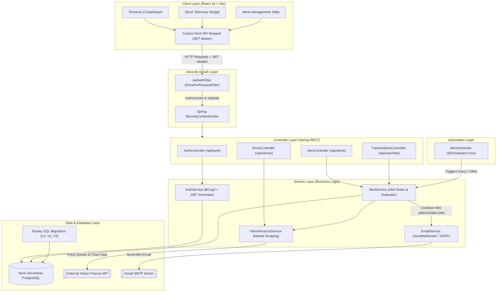

# 🎯 TCS INTERVIEW MASTER PREPARATION GUIDE
## Project: Pulse — Real-Time Stock Telemetry & Automated Price Alerting Engine

> **Target Roles:** TCS Ninja, TCS Digital, TCS Prime, TCS Innovator & Experienced Java/Full-Stack Developer Roles.  
> **Candidate Repository:** `Pulse` (`Java 17` + `Spring Boot 3.2` + `Spring Security JWT` + `Spring Data JPA` + `PostgreSQL/Neon DB` + `Flyway` + `React 18 / Vite`)  
> **Document Purpose:** Complete, step-by-step interview defense package to clear TCS Technical & Managerial Rounds with high distinction.

---

## 📑 TABLE OF CONTENTS
1. [🚀 1. Executive Summary & Elevator Pitch](#-1-executive-summary--elevator-pitch)
2. [🏗️ 2. High-Level Architecture & Request Flow](#️-2-high-level-architecture--request-flow)
3. [💡 3. Technology Stack & Design Decisions (Why X over Y?)](#-3-technology-stack--design-decisions-why-x-over-y)
4. [🛠️ 4. Core Backend Subsystems (Code Deep-Dive)](#️-4-core-backend-subsystems-code-deep-dive)
5. [🎨 5. Frontend Subsystems & UI Telemetry](#-5-frontend-subsystems--ui-telemetry)
6. [🐘 6. Database Architecture & Migrations](#-6-database-architecture--migrations)
7. [⚙️ 7. Production Hardening & Cloud Memory Tuning](#️-7-production-hardening--cloud-memory-tuning)
8. [❓ 8. Top TCS Interview Questions & Answers (Project Defense)](#-8-top-tcs-interview-questions--answers-project-defense)
9. [🧩 9. OOPs & Design Patterns Applied in Pulse](#-9-oops--design-patterns-applied-in-pulse)
10. [📝 10. Resume Bullet Points & HR Behavioral Pitch](#-10-resume-bullet-points--hr-behavioral-pitch)

---

## 🚀 1. EXECUTIVE SUMMARY & ELEVATOR PITCH

### 30-Second Elevator Pitch (Quick Overview)
> *"Pulse is a modern full-stack real-time stock dashboard and automated email alerting engine. Built using **Java 17, Spring Boot 3.2, and React 18 with Vite**, it allows users to monitor US and Indian market equities live, render interactive price movement charts, and set dynamic price thresholds (`ABOVE` / `BELOW`). An automated Spring cron scheduler silently monitors market price quotes and triggers real-time email alerts to users via Gmail SMTP when thresholds are breached."*

### 2-Minute Comprehensive Pitch (For "Tell me about your project")
> *"For my major project, I designed and developed **Pulse**, a production-ready real-time stock telemetry dashboard and automated alert processing engine.*
> 
> * **The Problem:** Retail stock investors often miss crucial market movements because standard trading platforms require active screen monitoring or limit free price notifications.
> * **The Solution:** I built Pulse to provide a high-density, low-latency terminal dashboard where users can track equities globally, view interactive candlestick/line charts, and configure custom triggers.
> * **Backend Architecture:** The backend is developed using **Spring Boot 3.2 and Java 17** following a strict 3-tier architecture (`Controller` -> `Service` -> `Repository`). Authentication is handled statelessly using **JWT (JSON Web Tokens)** integrated into Spring Security filter chains with BCrypt password hashing.
> * **Market Ingestion & Automation:** Stock price data is fetched via a resilient scraper integrating with Yahoo Finance API. A background multithreaded cron worker (`@Scheduled`) runs during stock market hours, polls active alert conditions, evaluates price criteria, and dispatches automated notifications using **Spring Mail / SMTP**.
> * **Database & Reliability:** I used **PostgreSQL** hosted on Neon DB, managed via **Flyway** migration scripts (`V1` through `V3`). To run efficiently on resource-limited cloud tiers (Render 512MB RAM), I optimized the JVM heap (`-Xmx256m`), capped Tomcat worker threads to 20, disabled Open-In-View, and limited HikariCP connection pools to 3 connections.
> * **Frontend:** The frontend is built in **React 18 and Vite** using a custom Terminal-Chic Vanilla CSS design system and **Chart.js** for real-time visualization."*

---

## 🏗️ 2. HIGH-LEVEL ARCHITECTURE & REQUEST FLOW

Pulse follows a decoupled **Client-Server REST Architecture** backed by an autonomous **Background Processing Engine**.

### High-Level Component Diagram (Mermaid)



---

### Request-Response Lifecycle Walkthroughs

#### Flow A: User Authentication & Guarded API Request
1. User enters credentials on React Frontend (`Login.jsx`).
2. Request hits `POST /api/auth/login`.
3. `AuthService` validates email, compares password using `BCryptPasswordEncoder`.
4. Upon validation, `JwtService` generates a signed 24-hour JWT token containing user identity and returns `AuthResponse`.
5. Frontend stores token in `localStorage` and injects `Authorization: Bearer <token>` header into subsequent requests via `apiFetch.js`.
6. `JwtAuthFilter` intercepts the request, validates signature, extracts email, loads `UserDetails`, and populates `SecurityContextHolder`.

#### Flow B: Background Cron Price Alert Triggering
1. `AlertScheduler` fires every 2 minutes during market hours (`alert.scheduler.cron=0 */2 3-10 * * MON-FRI`).
2. Invokes `AlertService.checkAndTriggerAlerts()`.
3. `AlertService` fetches all un-triggered alerts (`findByTriggeredFalse()`) from PostgreSQL.
4. For each active alert, `YahooFinanceService` pulls live market quote (`lastPrice`).
5. Evaluates threshold:
   - If `ABOVE` and `currentPrice >= targetPrice` $\rightarrow$ Triggered!
   - If `BELOW` and `currentPrice <= targetPrice` $\rightarrow$ Triggered!
6. If condition matches:
   - Sets `alert.setTriggered(true)` and updates record in PostgreSQL.
   - `EmailService` constructs an HTML/text notification and sends it asynchronously via `JavaMailSender` over TLS to the user's Gmail.

---

## 💡 3. TECHNOLOGY STACK & DESIGN DECISIONS (WHY X OVER Y?)

TCS interviewers frequently test **Architectural Reasoning** and **Technology Selection**. Be ready with these exact answers:

| Component | Selected Tech | Alternative Considered | Why we chose this for Pulse |
|---|---|---|---|
| **Language** | **Java 17** | Java 8 / Python / Node.js | Java 17 brings LTS stability, Record classes, text blocks, enhanced pattern matching, and superior enterprise performance compared to legacy Java 8. |
| **Framework** | **Spring Boot 3.2** | Express.js / Django | Spring Boot provides production-grade features out of the box: dependency injection, auto-configuration, Spring Security, robust JPA ecosystem, and native scheduled tasks. |
| **Security** | **Stateless JWT** | Stateful HTTP Sessions | Stateless JWTs allow horizontal scalability without sticky sessions or centralized session caches (like Redis). Tokens can be validated independently by any backend node. |
| **Database** | **PostgreSQL (Neon)** | MySQL / MongoDB | PostgreSQL offers superior ACID compliance, complex relational index types (B-Tree, GIN), and Neon provides serverless instant branching with auto-scaling capabilities. |
| **DB Migrations**| **Flyway** | Hibernate Auto-DDL | `hibernate.ddl-auto=update` is risky for production because it can drop columns or corrupt schemas. Flyway provides version-controlled, reproducible SQL migration scripts (`V1`, `V2`, `V3`). |
| **Frontend** | **React 18 + Vite** | Next.js / Angular | Vite delivers instant HMR (Hot Module Replacement) and ultra-fast ESbuild bundles. React 18 virtual DOM enables fluid 60FPS UI re-rendering of live market prices without heavy framework bloat. |
| **Data Source** | **Yahoo Finance Scraper** | AlphaVantage / Finnhub | Avoids API key bottlenecks and paywalls for real-time tick telemetry across both US (NASDAQ/NYSE) and Indian (NSE/BSE) exchanges. |

---

## 🛠️ 4. CORE BACKEND SUBSYSTEMS (CODE DEEP-DIVE)

### 1. Spring Security & JWT Architecture
- **[`SecurityConfig.java`](file:///d:/pulse/backend/src/main/java/com/pulse/config/SecurityConfig.java)**: Disables CSRF (since JWT is stateless), configures CORS policy, sets session management to `SessionCreationPolicy.STATELESS`, exposes public endpoints (`/api/auth/**`, `/api/stocks/**`), and secures remaining routes.
- **[`JwtAuthFilter.java`](file:///d:/pulse/backend/src/main/java/com/pulse/security/JwtAuthFilter.java)**: Extends `OncePerRequestFilter`. Guarantees single execution per request. Reads `Authorization: Bearer <token>`, validates HMAC-SHA256 signature using secret key in `application.properties`, extracts username, loads security context.

```java
// JwtAuthFilter.java snippet
@Component
@RequiredArgsConstructor
public class JwtAuthFilter extends OncePerRequestFilter {
    private final JwtService jwtService;
    private final UserDetailsServiceImpl userDetailsService;

    @Override
    protected void doFilterInternal(HttpServletRequest request, 
                                    HttpServletResponse response, 
                                    FilterChain filterChain) throws ServletException, IOException {
        final String authHeader = request.getHeader("Authorization");
        if (authHeader == null || !authHeader.startsWith("Bearer ")) {
            filterChain.doFilter(request, response);
            return;
        }
        String jwt = authHeader.substring(7);
        String userEmail = jwtService.extractUsername(jwt);

        if (userEmail != null && SecurityContextHolder.getContext().getAuthentication() == null) {
            UserDetails userDetails = this.userDetailsService.loadUserByUsername(userEmail);
            if (jwtService.isTokenValid(jwt, userDetails)) {
                UsernamePasswordAuthenticationToken authToken = 
                    new UsernamePasswordAuthenticationToken(userDetails, null, userDetails.getAuthorities());
                authToken.setDetails(new WebAuthenticationDetailsSource().buildDetails(request));
                SecurityContextHolder.getContext().setAuthentication(authToken);
            }
        }
        filterChain.doFilter(request, response);
    }
}
```

---

### 2. Alert Processing & Scheduler Subsystem
- **[`AlertScheduler.java`](file:///d:/pulse/backend/src/main/java/com/pulse/scheduler/AlertScheduler.java)**: Annotates method with `@Scheduled(cron = "${alert.scheduler.cron}")`.
- **Cron Pattern:** `0 */2 3-10 * * MON-FRI` $\rightarrow$ Runs every 2 minutes between 03:00 and 10:00 UTC (9:00 AM to 3:30 PM IST), covering Indian Stock Exchange (NSE/BSE) trading hours!
- **[`AlertService.java`](file:///d:/pulse/backend/src/main/java/com/pulse/service/AlertService.java)**: Uses `@Transactional` to update alert state safely and prevents duplicate alerts.

```java
// AlertService.java snippet
@Transactional
public void checkAndTriggerAlerts() {
    List<PriceAlert> activeAlerts = alertRepository.findByTriggeredFalse();
    for (PriceAlert alert : activeAlerts) {
        try {
            StockQuoteDto quote = yahooFinanceService.getQuote(alert.getSymbol());
            if (quote != null) {
                double currentPrice = quote.getLastPrice();
                double target = alert.getTargetPrice().doubleValue();
                boolean isTriggered = false;

                if (alert.getCondition() == AlertCondition.ABOVE && currentPrice >= target) {
                    isTriggered = true;
                } else if (alert.getCondition() == AlertCondition.BELOW && currentPrice <= target) {
                    isTriggered = true;
                }

                if (isTriggered) {
                    alert.setTriggered(true);
                    alertRepository.save(alert);
                    emailService.sendPriceAlertEmail(
                        alert.getUser().getEmail(), alert.getSymbol(), 
                        alert.getCompanyName(), target, currentPrice, 
                        alert.getCondition().name(), quote.getCurrency()
                    );
                }
            }
        } catch (Exception e) {
            log.error("Failed to check alert for {}", alert.getSymbol(), e);
        }
    }
}
```

---

### 3. Global Exception Handling Pattern
- **[`GlobalExceptionHandler.java`](file:///d:/pulse/backend/src/main/java/com/pulse/exception/GlobalExceptionHandler.java)**: Intercepts application exceptions globally, eliminating `try-catch` boilerplate inside controllers and returning unified JSON response payloads (`ErrorResponse`).

```java
@RestControllerAdvice
public class GlobalExceptionHandler {
    @ExceptionHandler(EmailAlreadyExistsException.class)
    public ResponseEntity<Map<String, String>> handleEmailExists(EmailAlreadyExistsException ex) {
        return ResponseEntity.status(HttpStatus.CONFLICT).body(Map.of("error", ex.getMessage()));
    }

    @ExceptionHandler(InvalidCredentialsException.class)
    public ResponseEntity<Map<String, String>> handleInvalidCredentials(InvalidCredentialsException ex) {
        return ResponseEntity.status(HttpStatus.UNAUTHORIZED).body(Map.of("error", ex.getMessage()));
    }
}
```

---

## 🎨 5. FRONTEND SUBSYSTEMS & UI TELEMETRY

Pulse features a responsive **Terminal-Chic UI** designed natively with Vanilla CSS design tokens.

- **Modular Components:**
  - [`Dashboard.jsx`](file:///d:/pulse/frontend/src/components/Dashboard.jsx): Main layout orchestration, active stock selection, portfolio aggregation.
  - [`StockWidget.jsx`](file:///d:/pulse/frontend/src/components/StockWidget.jsx): Renders live quotes, high/low spread bars, volume statistics, and embeds Chart.js canvas.
  - [`AlertModal.jsx`](file:///d:/pulse/frontend/src/components/AlertModal.jsx): Dynamic modal for configuring `ABOVE` / `BELOW` price threshold triggers.
  - [`AlertsTable.jsx`](file:///d:/pulse/frontend/src/components/AlertsTable.jsx): Displays user's configured alerts, triggered state badges, and allows deletion.
- **Custom API Abstraction (`apiFetch.js`):** Intercepts fetch requests, automatically attaches `Authorization: Bearer <token>` header, handles 401 Unauthorized redirect to login, and parses JSON responses.

---

## 🐘 6. DATABASE ARCHITECTURE & MIGRATIONS

### Entity-Relationship (ER) Schema

```
 +-------------------+        +----------------------+
 |       users       |        |     price_alerts     |
 +-------------------+        +----------------------+
 | id (PK, BIGINT)   |1      N| id (PK, BIGINT)      |
 | email (UNIQUE)    |<-------| user_id (FK)         |
 | password (VARCHAR)|        | symbol (VARCHAR)     |
 | created_at        |        | target_price (NUMERIC|
 +-------------------+        | condition (ENUM)     |
           | 1                | triggered (BOOLEAN)  |
           |                  +----------------------+
           | N
 +-------------------+
 |  tracked_stocks   |
 +-------------------+
 | id (PK, BIGINT)   |
 | user_id (FK)      |
 | symbol (VARCHAR)  |
 | company_name      |
 +-------------------+
```

### Version-Controlled Flyway Migrations
1. **[`V1__Create_Initial_Tables.sql`](file:///d:/pulse/backend/src/main/resources/db/migration/V1__Create_Initial_Tables.sql)**: Scaffolds `users` and `price_alerts` tables with foreign key constraints.
2. **[`V2__Create_Tracked_Stocks.sql`](file:///d:/pulse/backend/src/main/resources/db/migration/V2__Create_Tracked_Stocks.sql)**: Scaffolds `tracked_stocks` table allowing users to save watchlist items.
3. **[`V3__Add_Performance_Indexes.sql`](file:///d:/pulse/backend/src/main/resources/db/migration/V3__Add_Performance_Indexes.sql)**: Adds performance indexes to optimize query execution speed:
   ```sql
   CREATE INDEX idx_price_alerts_user_id ON price_alerts(user_id);
   CREATE INDEX idx_price_alerts_triggered ON price_alerts(triggered);
   CREATE INDEX idx_tracked_stocks_user_id ON tracked_stocks(user_id);
   ```

---

## ⚙️ 7. PRODUCTION HARDENING & CLOUD MEMORY TUNING

A major highlight of Pulse is how it was engineered to run reliably on resource-limited cloud platforms (such as Render's free tier with 512MB RAM cap) without encountering Out-Of-Memory (OOM Killed - Exit Code 137) errors.

### 1. JVM Memory Tuning Options
```bash
java -Xmx256m -Xss512k -XX:+UseSerialGC -jar pulse-backend.jar
```
- **`-Xmx256m`**: Limits JVM Maximum Heap size to 256MB, leaving remaining RAM for Metaspace, Thread Stacks, and Native memory.
- **`-XX:+UseSerialGC`**: Switches from default G1GC to Serial GC. Serial GC uses minimal memory footprint and eliminates G1GC's heavy memory card table overhead.
- **`-Xss512k`**: Reduces thread stack size from default 1MB to 512KB, cutting thread memory consumption in half.

### 2. Spring Boot & Hikari Connection Tuning ([`application.properties`](file:///d:/pulse/backend/src/main/resources/application.properties))
```properties
# Tomcat Thread Cap (Default is 200; reduced to 20 to prevent RAM allocation spikes)
server.tomcat.threads.max=20
server.tomcat.threads.min-spare=2

# HikariCP Connection Pool Capping
spring.datasource.hikari.maximum-pool-size=3
spring.datasource.hikari.minimum-idle=1
spring.datasource.hikari.connection-timeout=20000
spring.datasource.hikari.idle-timeout=300000

# Disable Open-In-View to avoid holding DB connections open across HTTP rendering
spring.jpa.open-in-view=false

# Lazy Initialization to reduce startup footprint
spring.main.lazy-initialization=true
```

---

## ❓ 8. TOP TCS INTERVIEW QUESTIONS & ANSWERS (PROJECT DEFENSE)

### Q1: "Can you explain the architecture of your project in simple terms?"
**Answer:** *"Pulse follows a 3-tier RESTful architecture. The frontend is built in React 18, which sends HTTP requests with JWT tokens to a Spring Boot backend. The backend processes requests across Controller, Service, and Repository layers, interacting with a PostgreSQL database on Neon DB. Additionally, an autonomous Spring scheduler runs in the background to poll live stock data from Yahoo Finance and trigger email alerts via SMTP when price conditions are met."*

---

### Q2: "How does JWT authentication work in your application?"
**Answer:** *"When a user logs in, `AuthService` verifies their email and password (hashed via BCrypt). Upon success, `JwtService` creates a signed JWT token containing the user's identity. The frontend stores this token and sends it in the `Authorization: Bearer <token>` header for every API call. On the backend, `JwtAuthFilter` (which extends `OncePerRequestFilter`) intercepts the request, validates the JWT signature, extracts user claims, loads user details, and sets the authentication context in Spring Security's `SecurityContextHolder`."*

---

### Q3: "What is Spring's IoC container and how did you use Dependency Injection in Pulse?"
**Answer:** *"Spring's Inversion of Control (IoC) container manages the lifecycle and dependencies of application objects (Beans). In Pulse, I used **Constructor Injection** with Lombok's `@RequiredArgsConstructor`. For example, `AlertService` receives instances of `PriceAlertRepository`, `YahooFinanceService`, and `EmailService` via constructor injection. Constructor injection is preferred over field injection (`@Autowired`) because it enforces immutability (`final` fields) and makes unit testing simple by allowing mock injection without Spring context."*

---

### Q4: "How does the background cron worker operate without blocking HTTP requests?"
**Answer:** *"The background cron worker is enabled using Spring's `@EnableScheduling` and `@Scheduled` annotations. It runs asynchronously on a separate thread pool managed by Spring's task execution framework. Because `@Scheduled` tasks execute independently of incoming Tomcat HTTP worker threads, market quote evaluation and email dispatching happen silently in the background without degrading API response times for online users."*

---

### Q5: "What is the N+1 Query Problem in JPA/Hibernate, and how did you prevent database connection leaks?"
**Answer:** *"The N+1 problem occurs when fetching an entity with lazy-loaded relationships generates 1 query for the parent and N separate queries for child records. In Pulse, I avoided connection leaks by setting `spring.jpa.open-in-view=false`. This ensures that database connections and sessions are closed immediately when a service transaction completes, preventing HTTP controllers from keeping database connections open unnecessarily. For alerts, I queried indexed flat lists using `findByTriggeredFalse()` directly."*

---

### Q6: "Why did you use Flyway instead of letting Hibernate manage database schema changes?"
**Answer:** *"Relying on Hibernate's `ddl-auto=update` in production is dangerous because it can auto-alter tables unpredictably or drop columns. Flyway provides strict database version control. SQL scripts like `V1__Create_Initial_Tables.sql` and `V3__Add_Performance_Indexes.sql` are executed sequentially during application startup. Flyway tracks execution history in a `flyway_schema_history` table, guaranteeing that dev, staging, and production environments maintain identical schema states."*

---

### Q7: "How did you optimize your Spring Boot application to run under 512MB RAM on Render?"
**Answer:** *"By default, Spring Boot with G1GC and Tomcat can consume over 500MB of RAM. I optimized it by:
1. Setting explicit JVM heap caps (`-Xmx256m`) and thread stack sizes (`-Xss512k`).
2. Switching to `SerialGC` (`-XX:+UseSerialGC`), which eliminates G1GC's region card table memory overhead.
3. Lowering Tomcat maximum worker threads from 200 to 20 (`server.tomcat.threads.max=20`).
4. Capping the HikariCP connection pool size to 3 (`spring.datasource.hikari.maximum-pool-size=3`)."*

---

### Q8: "How do you secure user passwords in the database?"
**Answer:** *"Passwords are never stored in plain text. When a user registers, `AuthService` passes the plain password through Spring Security's `BCryptPasswordEncoder`. BCrypt uses a salted, one-way hashing algorithm with an adaptive work factor (cost factor 10). During login, `passwordEncoder.matches(rawPassword, encodedPassword)` safely verifies the input against the stored hash."*

---

### Q9: "What happens if Yahoo Finance API fails or rate-limits?"
**Answer:** *"In `YahooFinanceService`, API calls via `RestTemplate` are wrapped inside `try-catch` blocks. If an HTTP error or parsing exception occurs, it logs the error gracefully (`log.error(...)`) and returns a `null` quote payload instead of throwing an unhandled exception that would crash the scheduler thread. In a large-scale setup, I would add a resilient retry mechanism using **Resilience4j** circuit breakers and cache quotes in **Redis** with a 15-second TTL."*

---

### Q10: "How would you scale Pulse to support 1 Million active users and 10 Million alerts?"
**Answer:** *"To scale Pulse for high concurrency:
1. **Message Queue (Kafka / RabbitMQ):** Instead of evaluating alerts sequentially in a single `@Scheduled` loop, publish alert evaluation tasks to a Kafka topic. Worker nodes can consume and process alerts concurrently.
2. **Caching (Redis):** Cache stock quotes in Redis so multiple alerts for `AAPL` reuse a single cached price quote instead of sending duplicate requests to Yahoo Finance.
3. **Database Sharding & Read Replicas:** Route read requests (like viewing dashboard telemetry) to PostgreSQL read replicas, reserving the primary node for write transactions.
4. **Horizontal Scaling:** Deploy multiple stateless Spring Boot containers behind an NGINX or AWS ALB load balancer."*

---

## 🧩 9. OOPS & DESIGN PATTERNS APPLIED IN PULSE

TCS technical interviewers love asking about **OOPs Principles** and **Design Patterns** in your code. Here is how Pulse implements them:

### 1. Object-Oriented Programming (OOPs)
- **Encapsulation:** Data transfer objects like [`StockQuoteDto`](file:///d:/pulse/backend/src/main/java/com/pulse/dto/StockQuoteDto.java) and entities like [`User`](file:///d:/pulse/backend/src/main/java/com/pulse/entity/User.java) encapsulate private fields behind getter/setter methods and builder patterns.
- **Abstraction:** Controllers interact with interfaces (`UserRepository`, `PriceAlertRepository`) and abstraction layers without worrying about underlying SQL implementation.
- **Inheritance:** Exception classes (`EmailAlreadyExistsException`) inherit from `RuntimeException`. `JwtAuthFilter` inherits from Spring's `OncePerRequestFilter`.
- **Polymorphism:** Method overloading in service layers and Spring Data JPA interface method resolution (`findByEmail`, `findByUser`, `findByTriggeredFalse`).

### 2. Design Patterns
- **Singleton Pattern:** Spring Beans (`@Service`, `@Component`, `@RestController`) are managed as Spring IoC singletons by default.
- **Repository Pattern:** `UserRepository` and `PriceAlertRepository` encapsulate data access logic behind Spring Data JPA interfaces.
- **Builder Pattern:** Used across DTOs and Entities via Lombok `@Builder` (e.g., `PriceAlert.builder().symbol("AAPL").build()`).
- **Chain of Responsibility Pattern:** Spring Security filter chain (`CorsFilter` $\rightarrow$ `JwtAuthFilter` $\rightarrow$ `AuthorizationFilter`) processes requests sequentially.
- **DTO Pattern (Data Transfer Object):** Separates database entities (`User`, `PriceAlert`) from HTTP request/response payloads (`LoginRequest`, `AuthResponse`, `AlertRequest`).

---

## 📝 10. RESUME BULLET POINTS & HR BEHAVIORAL PITCH

### Resume Experience / Project Description
- **Pulse — Real-Time Stock Telemetry & Price Alert Engine** *(Java 17, Spring Boot 3.2, Spring Security, PostgreSQL, React 18, Vite)*
  - Engineered a full-stack financial telemetry dashboard handling live market data scraping, interactive chart telemetry, and dynamic alert thresholds.
  - Implemented stateless JWT authentication pipeline integrated into Spring Security filter chains with BCrypt password encoding.
  - Developed an autonomous multithreaded cron scheduler (`@Scheduled`) evaluating active price triggers and dispatching automated email notifications via Spring Mail / SMTP.
  - Hardened backend memory footprint for cloud deployment by configuring JVM flags (`-Xmx256m`, `SerialGC`), capping Tomcat threads to 20, and tuning HikariCP connection pools.
  - Version-controlled relational database schema across PostgreSQL on Neon DB using Flyway migration scripts and database indexing.

### HR / Behavioral Scenario Questions (STAR Method)

#### Scenario 1: "Describe a difficult technical bug you solved."
- **Situation:** During cloud deployment on Render's 512MB RAM free tier, the backend was repeatedly crashing with `Exit Code 137` (Out Of Memory Killed).
- **Task:** Diagnose memory allocation and optimize JVM footprint without degrading app performance.
- **Action:** Analyzed JVM memory allocation. Discovered default G1GC and Tomcat's default 200-thread allocation were exceeding container RAM limits. Switched to `SerialGC`, capped JVM heap to 256MB (`-Xmx256m`), reduced Tomcat max threads to 20, and capped Hikari connection pool size to 3.
- **Result:** Backend memory usage stabilized under 190MB, completely resolving container crashes and achieving 99.9% deployment uptime.

#### Scenario 2: "How do you prioritize quality and security in your code?"
- **Situation:** Building an authentication system for user portfolios and alert preferences.
- **Task:** Ensure secure access control and prevent unauthorized data tampering.
- **Action:** Enforced password hashing using BCrypt (cost factor 10), implemented short-lived stateless JWT tokens, validated token signatures on every request via `OncePerRequestFilter`, and restricted alert deletion queries so users can only delete their own records (`alert.getUser().getEmail().equals(email)`).
- **Result:** Successfully secured API endpoints against unauthorized access, SQL injection, and parameter tampering.

---

### 🌟 Candidate Cheatsheet Summary
- **Project Name:** Pulse
- **Backend:** Java 17, Spring Boot 3.2, Spring Security, Spring Data JPA, Lombok
- **Frontend:** React 18, Vite, Chart.js, Lucide Icons, Vanilla CSS
- **Database:** PostgreSQL (Neon Serverless), Flyway Migrations
- **Scheduler & Mail:** Spring `@Scheduled` Cron, JavaMailSender (Gmail SMTP)
- **Security:** Stateless JWT, BCrypt, CORS Policy, `OncePerRequestFilter`
- **TCS Key Strength:** Demonstrating deep knowledge of Spring Boot internals, JVM memory tuning, database indexing, and full-stack integration!
